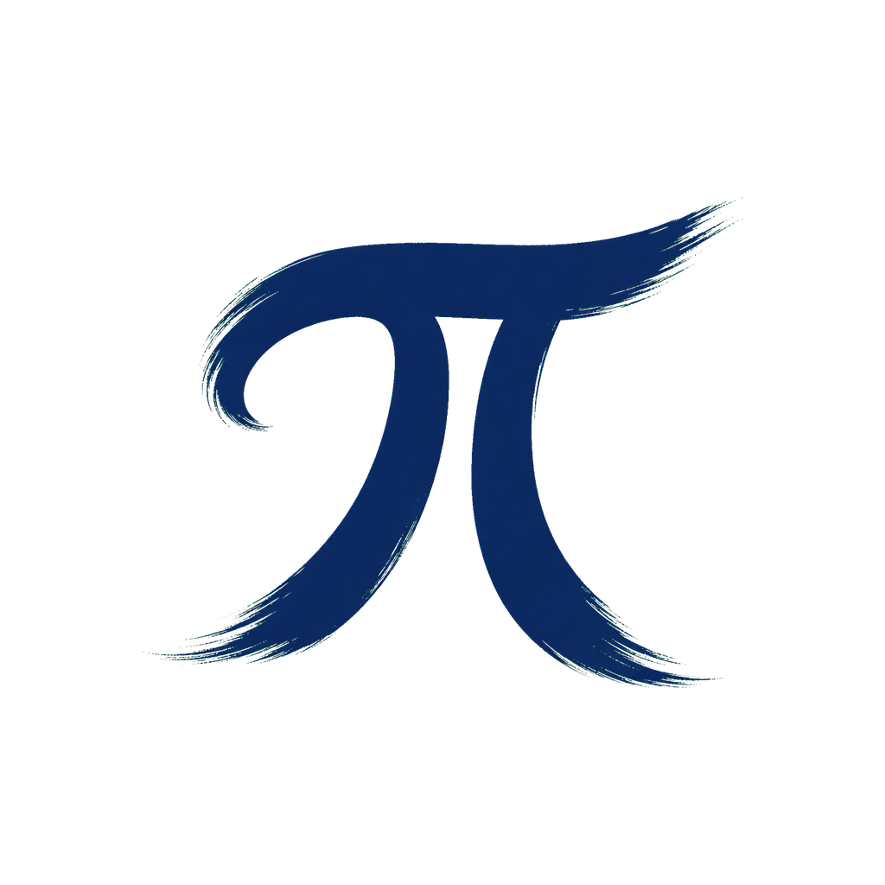

<p align="center">
  
</p>
<p align="center"><a href="https://github.com/earendil-works/pi">Pi coding agent</a>를 위한 데스크톱 및 Web 작업 공간.</p>
<p align="center">
  <a href="https://github.com/tyql688/ling/actions/workflows/ci.yml"></a>
  <a href="LICENSE"></a>
</p>
<p align="center"><a href="README.md">English</a> | <a href="README.zh-CN.md">简体中文</a> | <a href="README.ja.md">日本語</a> | 한국어</p>

Ling은 Pi 대화, 프로젝트 파일, 변경 사항 검토, 터미널을 하나의 작업 공간에 모읍니다. Electron 앱과 브라우저 클라이언트는 같은 UI와 로컬 Host를 사용합니다. Pi SDK를 직접 내장하고 Pi의 기본 디렉터리인 `~/.pi/agent`를 사용하므로 기존 인증 정보, 모델, 패키지, 스킬, 설정을 CLI와 함께 사용할 수 있습니다.

## 기능

- **프로젝트 대화:** 스트리밍 응답, 모델과 사고 수준 선택, 대화 기록, 대화 분기, 메시지 대기열, 컨텍스트 압축을 지원합니다. 대화를 시작하려면 프로젝트를 열어야 합니다.
- **파일과 변경 사항 검토:** 독립된 읽기 영역, Monaco 편집기, 언어 서비스, Git 기록, 차이 보기, 검토 주석을 제공합니다. 파일을 열어도 원래 대화와 작성 중인 초안이 유지됩니다.
- **터미널과 작업:** 프로젝트 터미널, 백그라운드 명령, 예약된 에이전트 작업을 실행합니다.
- **Pi 리소스:** 패키지, 확장, 스킬, 프롬프트를 관리하고 열린 프로젝트와 세션에 다시 불러옵니다. Pi 확장의 질문과 상태 표시도 공통 UI에 통합됩니다.
- **내장 기능:** Todo, 접근 모드, 질문, 백그라운드 작업, 예약 작업을 각각 켜거나 끌 수 있습니다. Todo와 권한 기능은 상위 Pi 패키지를 사용하며, 사용자가 Pi를 통해 설치한 버전이 내장 버전보다 우선합니다.
- **외관과 사용량:** 밝은 테마와 어두운 테마, 내장 및 사용자 지정 선언형 스킨, 토큰·비용 통계, 지원되는 공급자의 이용 한도 정보를 제공합니다. UI는 영어, 중국어 간체, 일본어, 한국어를 지원합니다.

## 소스에서 실행

Node.js **22.19 이상**, Git, [package.json](package.json)에 지정된 pnpm 버전(현재 **11.25.0**)을 설치하세요.

```sh
git clone https://github.com/tyql688/ling.git
cd ling
pnpm install --frozen-lockfile
pnpm dev
```

브라우저 클라이언트를 사용하려면 `pnpm dev` 대신 다음 명령을 실행합니다.

```sh
pnpm dev:web
```

Host가 출력하는 인증된 로컬 URL을 여세요. URL의 프래그먼트에는 비공개 접근 토큰이 포함되어 있습니다. 브라우저에서 다루는 디렉터리는 **Host가 실행되는 컴퓨터**의 디렉터리입니다. 데스크톱 앱은 운영체제의 기본 폴더 선택 대화상자도 제공합니다. 두 클라이언트는 같은 프로젝트, 세션, 파일 서비스를 사용합니다.

처음 실행한 뒤 **설정 → 모델**에서 OAuth 또는 API 키로 공급자를 설정하고 프로젝트를 여세요. 기존 Pi 인증 정보도 재사용됩니다. Pi CLI 실행 파일을 별도로 설치할 필요는 없습니다. 모델 요청은 내장 SDK를 통해 전송되며 공급자의 사용 요금이 발생할 수 있습니다.

Host는 기본적으로 루프백 주소에서만 수신합니다. Pi의 인증 정보, 설정, 세션 파일은 계속 Pi가 관리합니다. SQLite 메타데이터와 내장 기능 상태를 포함한 Ling 애플리케이션 데이터는 별도로 저장됩니다. 데이터 관리 주체와 격리 실행 방법은 [아키텍처](docs/architecture.md)와 [개발 안내](docs/development.md)를 참고하세요.

## 기술 스택과 주요 라이브러리

주요 기술과 실제 용도를 정리한 표입니다. 직접 의존하는 전체 패키지는 각 작업 공간의 매니페스트에, 확정된 의존성 그래프는 [pnpm-lock.yaml](pnpm-lock.yaml)에 기록되어 있습니다.

| 영역 | 기술과 라이브러리 |
| --- | --- |
| 언어와 작업 공간 | TypeScript, pnpm workspaces. 컴파일과 언어 서비스에는 TypeScript 7, ESLint 호환성 유지에는 별도의 TypeScript 6 의존성 사용 |
| 에이전트 실행 환경 | `@earendil-works/pi-coding-agent`, 내장 `@juicesharp/rpiv-todo` 및 `@gotgenes/pi-permission-system` 어댑터 |
| 데스크톱 | Electron, electron-vite, electron-builder, electron-updater, node-mac-permissions |
| Web과 상태 관리 | React 19, Vite, Jotai, jotai-family |
| UI | Tailwind CSS 4, Radix UI, Floating UI, Motion, cmdk, react-resizable-panels |
| 편집과 콘텐츠 표시 | Monaco Editor, Tiptap/ProseMirror, Markstream, Shiki, Pierre Diffs, Mermaid, KaTeX |
| 목록과 차트 | TanStack Virtual, use-stick-to-bottom, Recharts |
| 터미널과 프로젝트 파일 | xterm.js, node-pty, Parcel Watcher, simple-git, diff |
| 통신과 검증 | WebSocket(`ws`, PartySocket), `birpc` worker RPC, Zod. 편집기 서비스에는 vscode-jsonrpc와 Language Server Protocol 사용 |
| 저장과 동시 처리 | Node.js SQLite(`node:sqlite`), write-file-atomic, proper-lockfile, p-limit, lru-cache |
| 국제화와 아이콘 | i18next, react-i18next, Lucide, LobeHub icons, Material Icon Theme |
| 품질 검사 | Vitest, ESLint, typescript-eslint, Prettier, GitHub Actions |

## 저장소 구성

| 디렉터리 | 역할 |
| --- | --- |
| [`apps/web`](apps/web/package.json) | 공통 React UI, 기능별 상태, 브라우저·네이티브 환경 어댑터 |
| [`apps/desktop`](apps/desktop/package.json) | 네이티브 창, 운영체제 통합, 업데이트, Host 감독 |
| [`packages/host`](packages/host/package.json) | 프로젝트, 세션, 파일, Git, 터미널, 영구 저장, worker 관리 |
| [`packages/core`](packages/core/package.json) | Pi SDK 어댑터와 공통 비즈니스 데이터 처리 |
| [`packages/contracts`](packages/contracts/package.json) | 브라우저에서 사용할 수 있는 데이터 계약, 검증, 프로토콜 정의 |
| [`packages/node-runtime`](packages/node-runtime/package.json) | 원자적 파일 쓰기, 시작 로그, 프로세스 정리 |
| [`packages/builtin-extensions`](packages/builtin-extensions/package.json) | 내장 기능 호출을 Host에 전달하는 Pi 도구 |
| [`builtin-skills`](builtin-skills) | Ling 사용자에게 제공하는 스킬 |
| [`.agents/skills`](.agents/skills) | 저장소 유지보수 절차. 애플리케이션에는 포함되지 않음 |

## 개발

```sh
pnpm verify         # lint, 서식, 타입, 테스트 검사
pnpm build          # Web, Host, Desktop 프로덕션 빌드. 설치 파일은 생성하지 않음
pnpm format         # 소스와 문서 서식 정리
```

- [개발 안내](docs/development.md): 실행 명령, 기여 시 확인 사항, 격리 환경 검증, 버전 및 태그 정책.
- [아키텍처](docs/architecture.md): 패키지 경계, 데이터 관리 주체, 실행 시 역할.
- [디자인](docs/design.md): UI 동작, 공통 컨트롤, 접근성.
- [프로세스](docs/processes.md): worker 수명 주기, 감독, 진단.
- [AGENTS.md](AGENTS.md): 저장소 규칙과 테스트 선택 기준.

## 감사와 라이선스

Pi와 위에 나열된 오픈 소스 프로젝트에 감사드립니다. 초기 아트 스킨 갤러리는 [heige-codex-skin-studio](https://github.com/HeiGeAi/heige-codex-skin-studio)에서 영감을 받았습니다.

Ling 소스 코드는 [MIT 라이선스](LICENSE)로 제공됩니다. 타사 소프트웨어에는 각자의 라이선스가 적용됩니다. [타사 고지](THIRD_PARTY_NOTICES.md)를 참고하세요. 이미지, 동영상, 공급자 로고 및 기타 브랜드 자산은 코드 라이선스와 별개입니다. “Bundled with Ling”은 앱에 포함되어 있다는 표시이며 해당 자산의 사용 권한을 부여하지 않습니다.
