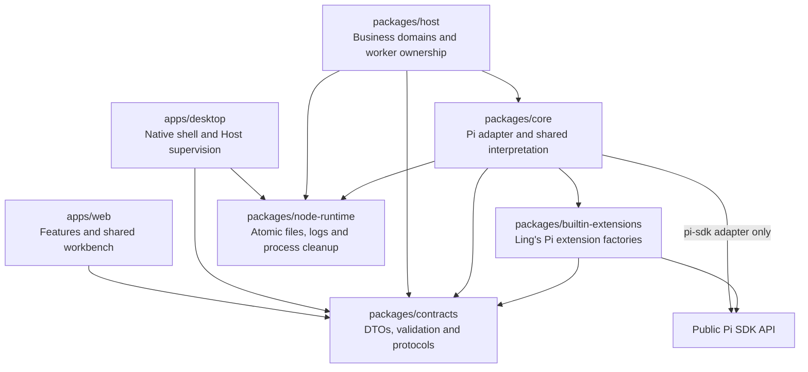
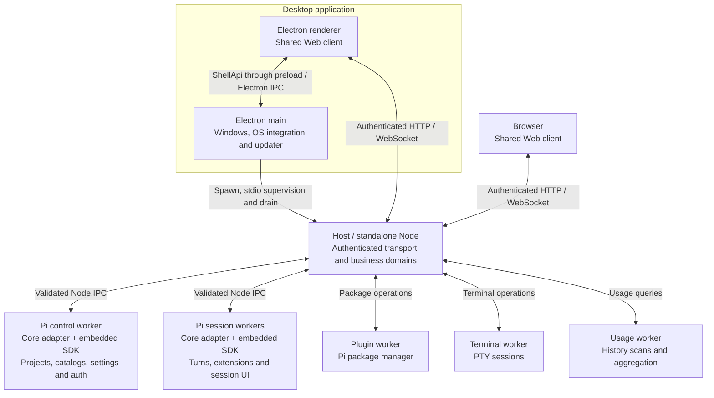
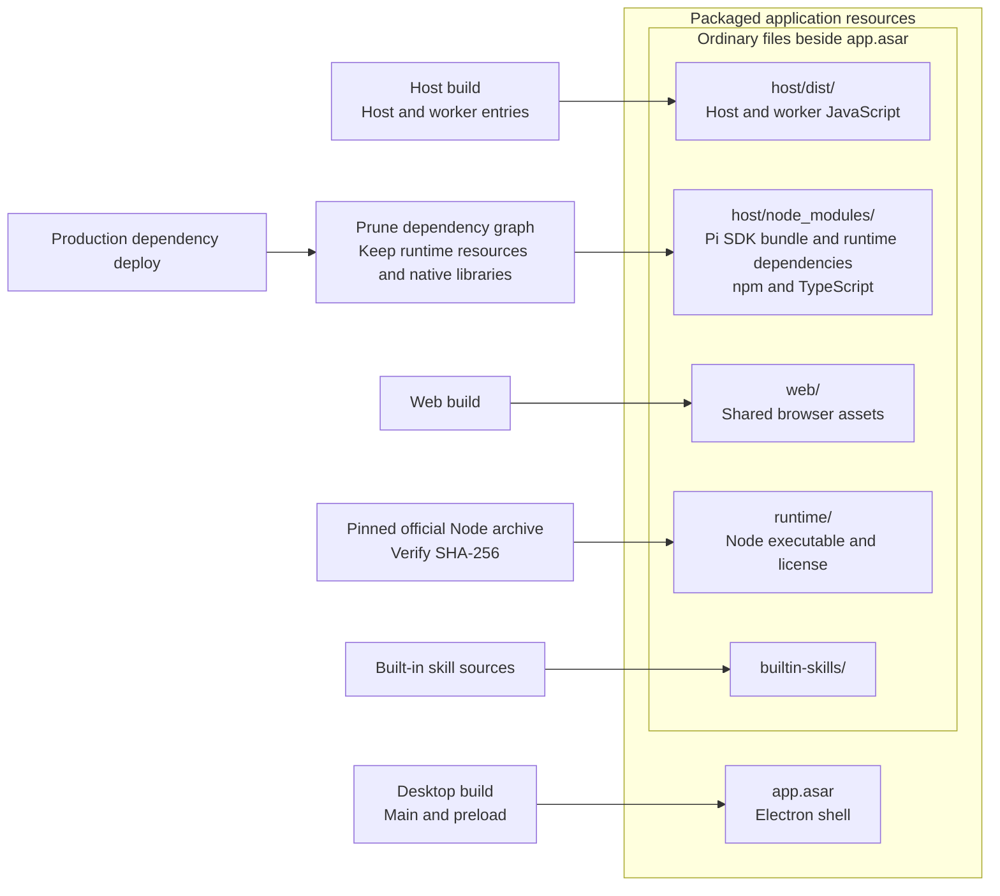
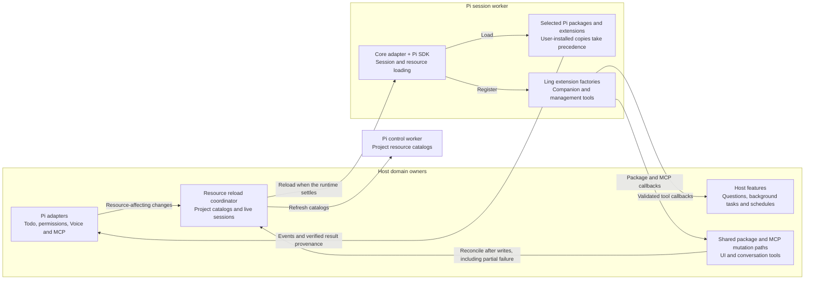

# Architecture

This is a map of current code owners. [AGENTS.md](../AGENTS.md) defines product boundaries, development rules and verification scope. [Design](design.md) defines the interface contract; [Development](development.md) describes local commands and isolation. Keep implementation budgets and specialized maintenance procedures with their source or owning skill.

## Runtime boundaries

| Package | Owns | May depend on |
| --- | --- | --- |
| `packages/contracts` | Browser-safe domain DTOs, validation, procedure declarations, client APIs and transport envelopes | Browser-safe dependencies |
| `packages/core` | Pi adaptation and protocol, pure review/transcript/usage interpretation, shared Node primitives | Contracts, built-in extensions and Node runtime primitives |
| `packages/host` | Business state, persistence, managed sessions, Git/files, application composition, authenticated transport and workers | Core, Contracts and Node runtime primitives |
| `packages/builtin-extensions` | Actual Pi extension implementations | Contracts and public Pi SDK APIs |
| `apps/web` | Feature state, controllers, views and browser transport/shell adapters | Contracts |
| `packages/node-runtime` | Bounded atomic publication, launch log files and process cleanup shared by native and business owners | Node libraries only |
| `apps/desktop` | Native windows, OS integration, updates and Host supervision | Contracts and Node runtime primitives |

### Code dependencies

Arrows point from a package to the code it imports. The Pi SDK edge is restricted to the Core adapter and actual extension implementations; other third-party libraries are omitted.



### Process communication

Boxes below represent process roles, with one Pi session worker for each live session runtime. Both clients run `apps/web` and send business requests directly to Host. Native shell calls use `ShellApi` through preload; worker calls use Node IPC. [Processes](processes.md) owns counts, restart policy, retention and shutdown details.



Host also owns project file/Git operations, editor subprocesses and background task processes. Under Desktop, Host and its workers share the staged Node executable. Browser mode uses the same Host and workers without the Electron processes.

### Packaged application

Electron and browsers use the same Web client and authenticated Host protocol. The Electron shell ships in `app.asar`. Desktop launches an independent Host with the official Node release pinned and checksum-verified by `apps/desktop/scripts/stage.ts`; Host, Web, built-in skills and Node ship as ordinary application resources. Pi extensions, native libraries and subprocesses retain normal Node filesystem and ABI behavior. The `runAsNode` fuse stays disabled. Desktop removes `NODE_OPTIONS` and `NODE_PATH` when launching Host and disables its SIGUSR1 inspector entry; Electron's fuses alone do not protect an independent Node process.

The build arrows show where executable code and resources end up. Core, Contracts, Node runtime primitives and Ling's extension factories are bundled into their consuming entries; the published Pi SDK bundle and its retained external dependencies remain in `host/node_modules`.



The Host build maps the public `@earendil-works/pi-coding-agent` import to the SDK's published `dist/bundle/index.js`. Pi's bundle embeds sibling packages and provider SDKs, supplies its virtual modules to extensions, and still imports some packages from disk. `apps/desktop/scripts/prune-host.ts` parses literal imports and `require.resolve` asset references, then follows each declared dependency from its actual installed location, preserving nested versions, ordinary peers and installed optional dependencies. Only audited Pi virtual peers are exempt. Missing required dependencies fail staging before deletion. The SDK retains its bundle, runtime assets, documents, examples and notices; npm and TypeScript retain their complete runtime trees. The pruning policy and optional-import exceptions require review on SDK upgrades.

Host supervises one Pi control worker, one Pi session worker per live runtime, and the plugin, usage and terminal workers; [Processes](processes.md) owns that topology, supervision and the diagnostics store. Every Pi worker embeds the SDK; a separate Pi CLI or server does not implement conversation runtime. Host enters the adapter through `packages/core/src/pi-sdk/entrypoints/`.

## Contracts and transport

Paths below are relative to `packages/contracts/src/`:

- Domain DTOs, portable validation, identity helpers and procedure tables live directly in `src/`.
- `procedure.ts` defines transport-neutral request/event declarations. Domain `*-procedures.ts` files specify channel names, argument schemas and result types once. Host and clients derive their registration and binding from those declarations.
- `api/host-procedures.ts` composes the business capability tree; `api/ling-api.ts` describes its native adaptation; `api/ling-api-client.ts` adapts transport and native capabilities into the application client. `api/shell-api.ts` and `api/shell-procedures.ts` own native capabilities, with validation repeated in Electron main.
- `protocol/channels.ts` derives the channel registry. `protocol/host-protocol.ts` owns authentication, request, error and replay envelopes. `window.d.ts` describes preload/bootstrap globals only.
- `ling-error.ts`, `session-ref.ts`, `owner-ref.ts`, `records.ts`, `text-validation.ts` and domain validation modules own shared failure, identity and normalization semantics. Domain-specific resource budgets remain distinct even when their numbers match.

Host Web protocol version 5 uses one rejected `LingError` path for failed requests. Domain partial results remain explicit values; errors cannot become authoritative empty success. Error codes are localized in Web, and unexpected failures retain an associated Host log identifier. The protocol test protects established channel identities and explicit additions; the procedure tables are the current capability inventory, including data, session, Pi package and editor-language operations.

Pi worker protocol version 5 assigns control/session roles in the startup handshake and is separate from Web transport. `packages/core/src/pi-protocol/` owns method tables, framing, generation checks, result validation, deadlines and replacement reservations. Domain/runtime/lifecycle/callback tables derive typed clients and worker dispatch. Method arguments admitted by Host are not parsed field by field again in worker dispatch. Disk, extension, callback and worker-result data retain their own boundary validation. Stable `PI_HOST_*` error codes remain wire identities despite the process being named Pi worker.

Pi settings updates use one owning schema, including Pi-compatible numeric values, unique default tools and native shell-path validation. Host validates input; the SDK owner applies the typed update. SDK persisted settings still have separate read and normalization semantics. Model compaction overrides preserve exact provider/model keys and unknown sibling settings. Cache warming is global, uses Pi’s canonical mode and reconciles live timers through the SDK setter when settings change. Its separate usage entries contribute to token/cost totals without adding assistant messages. Resource reload activates tools newly added to the resolved `defaultTools` selection while preserving each session’s enabled tools and deliberate disabled choices. Transcript-backed system instructions and tool changes remain in Pi history and model replay, outside the conversation row projection.

## Host owners

```text
packages/host/src/
  index.ts                 executable startup and shutdown
  app/                     business composition and domain registration
  runtime/                 deployment paths, environment, logs and project access ports
  transport/               authenticated HTTP/WebSocket, events and dialogs
  operations/              cancellation, admission and deadline execution
  storage/                 SQLite connection, transactions, schema and import health
  workers/                 shared worker spawn and RPC primitives
    pi/                    worker pool, per-process supervision, transport and runtime mirrors
    plugin/                package process supervision
    terminal/              terminal worker entry and protocol
    usage/                 scan, aggregation and usage worker lifecycle
  domains/
    data/                  shared drafts, user state and recovery requests
    diagnostics/           log store queries and live worker listing
    projects/              project lifetime, trust, catalogs and metadata cleanup
    sessions/              managed registry, runtime commands, dialogs and transcript paging
    files/                 project files and filesystem watchers
    editor/                project language processes, formatting and validated LSP operations
    git/                   Git operations, request adaptation and write serialization
    review/                checkpoints, lineage capture, queries, mutations and persistence
    models/                model configuration and authentication requests
    plugins/               package mutation operations and policy
    companions/            feature store, automatic runs, tool dispatch and Host-side labels
    interactions/          pending questions and approvals for Host features
    questions/             agent questions with retained answers and delivery
    background-tasks/      shell processes beside a session with bounded retained output
    schedules/             recurring agent runs, tick loop and run history
    pi-adapters/           Pi integrations: todo, permission activation, voice input and official MCP services
    skills/                skill management and CLI update workflow
    resources/             project/session resource reload coordination
    settings/              application settings, composer history and Pi settings
    skins/                 declarative skin package storage and discovery
    terminal/              PTY service and handlers
    usage/                 usage requests
```

`app/business-runtime.ts` acquires the database, domain stores, sessions, review, file watchers, workers, resource reload, project lifecycle and trust owners. `app/business-handlers.ts` composes domain factories with named dependencies. Each domain returns handlers and any owned cleanup. `app/domain-runtime.ts` registers cleanup before binding methods, so failed registration also rolls back the newly acquired domain. Common request handling owns validation, failure logging and normalization; domain handlers adapt transport to business owners.

`packages/node-runtime/src/runtime-lifetime.ts` records cleanup on acquisition. Shutdown stops admission before draining dependencies. Admitted package mutations reconcile resources before project teardown; project operations settle before session bridges and Pi are released; maintenance settles before the database closes. Startup rollback follows the same path, attempts every owner and retains all failures. Repeated disposal shares one result.

`domains/sessions/manager/` owns the managed session registry, metadata, lifecycle queue and commands. `domains/sessions/session-host.ts` binds dialogs, runtime events and cancellation. `domains/sessions/transcript-pager.ts` owns bounded cursor views over durable projection identities. `workers/pi/` owns remote runtime mirrors, attach buffers and reservations. Their consumers declare small lifecycle, project-access and projection-cache ports instead of importing application composition or handler modules.

Project/session coordination is supplied by `app/`. Runtime identity is canonical cwd; an opened runtime is required before Pi services can be acquired. The project lifecycle creates and opens `dataHome/conversations` at startup for conversations started without a user-selected project. Its `OpenProjectInfo.purpose` is `conversation`; ordinary projects use `project`. The lifecycle owns directory identity, retries, shutdown and protection from project removal. Saved project membership contains user-selected directories, while the managed target is restored independently on each launch. Each session retains its normal Pi storage, catalog, draft and reading-workset identity, and conversations in the managed target share working files. Directory creation or runtime initialization failures produce the existing partial-list error state. Session discovery may lag a live runtime. In-memory summaries survive that lag, and an idle empty SDK session is retained until its actual session file exists: Pi does not flush an empty history before its first assistant message.

Catalog mutations publish `session:catalog-changed` after create, fork, metadata changes and deletion. Every connected client refreshes changed summaries or removes deleted references immediately. A stale concurrent catalog scan cannot overwrite that notification. Deletion cascades through runtime subscriptions, dialogs, shared metadata and each client's active workspace bindings.

UI package operations and the conversation plugin tool converge in `domains/plugins/plugin-mutation.ts`. `domains/resources/resource-reload.ts` reconciles project catalogs and live sessions after mutations, including partial writes. Core's `plugin-host/` owns Pi package protocol/source interpretation; Host's plugin worker owns package process supervision. Configuration-only reloads retain compiled extension factories while re-running their initialization; explicit resource reloads and package mutations read fresh code. Busy and queued sessions retain the strongest pending reload mode. Host-only feature switches and Voice/MCP configuration skip project catalog reconstruction. Adapter switches update the catalog's bundled selection without rebuilding unrelated models, skills or user extensions; live sessions consume the new configuration through fresh factory instances. Built-in features are described below; the permission system's activation changes reconcile through the same resource owner.

Pi requests wait for the supervisor's actual ready handshake. Authentication cancellation fences deferred project admission; an already dispatched SDK flow is cancelled while its original result remains observed for credential reconciliation. A failed WebSocket peer closes independently. An uncaught Host failure stops admission, drains owned workers and exits with code 1 under a bounded deadline.

## Persistence and shared user state

`storage/database.ts` owns `ling.sqlite`, schema version 3, WAL with FULL synchronization, bounded lock waits, transactions and disposal. Domain stores own row validation and one-time imports. The database holds projects, session metadata/catalog caches, drafts and recovery versions, shared preferences/tabs, composer history, application settings, review state and cleanup retries. Pi session JSONL, Pi credentials/settings/packages, declarative skin files and Desktop shell state retain their original owners.

Each legacy source is imported with a transaction and an idempotent marker. The original JSON is preserved byte for byte. A failed source remains visible and retryable without erasing unrelated successful imports. Failed reads never trigger empty initialization. The implementation deliberately does not resume writing old JSON after a database failure: two writable authorities would make recovery ambiguous. One Data Health surface composes database, import and domain recovery results, with expandable/copyable detail and explicit retry.

`domains/data/draft-store.ts` serializes revision-based compare-and-write. A stale client preserves its input as a recoverable conflict instead of replacing another client's draft. Explicit clears keep revisions; choosing a recovery copy retains the displaced draft. Budgets reject excess retained data visibly. `domains/data/user-state-store.ts` applies row-level mutations and revisions for preferences, project labels/pins, tabs, seen markers, reviewed progress and skin scenes. Unrelated concurrent changes are preserved. Legacy session-tab data and mutations remain supported for persisted-state and protocol compatibility; the single-conversation renderer no longer reads or writes that membership. File selections, skill selections and review tab positions remain local to their window and session.

`lib/user-state/persistence.ts` and the session draft persistence owner hydrate Host snapshots, overlay pending local edits, and apply acknowledged revisions. A bounded local recovery journal contains only unacknowledged changes. Legacy localStorage sources are removed only after Host acknowledges the exact bytes being imported; damaged sources and concurrent edits remain recoverable. Moving to another Host origin no longer loses acknowledged user state. An inaccessible old origin still requires the user to reopen that origin before its browser-local legacy data can be imported.

Session deletion removes drafts, tabs, read markers and reviewed state in one database transaction. Deletion tombstones reject late writes that would recreate deleted session data. Client catalog notifications then clear active selection, mounted composer, viewer/dialog targets.

## Core and Pi adapter

Core retains shell-independent interpretation and SDK integration. `change-review/` contains pure review classification; `transcript/` owns durable entry identity; `skills/` owns CLI ledger/provenance interpretation; `store/atomic-file-store.ts` is a bounded primitive used by remaining file owners. Filesystem watchers, Git, durable business stores, managed-session orchestration, transcript paging and usage scans belong to Host.

`paths.ts` owns native path identity and lexical containment; filesystem canonicalization remains with the caller. `listeners.ts` isolates synchronous subscribers. Shared runtime/resource/discovery types and runtime ports live in `pi-protocol/`, without importing the managed-session registry. Record normalization shared with Web comes from Contracts.

| Pi adapter directory | Responsibility                                                                        |
| -------------------- | ------------------------------------------------------------------------------------- |
| `projects/`          | Project admission, trust, generation and coordinated reload                           |
| `models/`            | Catalogs, configuration, credential scopes and model runtime ownership                |
| `session/`           | SDK runtime construction, commands/queries, replacement, queue and message projection |
| `extensions/`        | Extension binding, Pi UI capability, rendering and input adaptation                   |
| `resources/`         | Pi packages, skill discovery and switches                                             |
| `settings/`          | Canonical Pi settings, mutation and network configuration                             |
| `worker/`            | Typed domain dispatch, dialog bridge and runtime registry                             |
| `entrypoints/`       | Executable adapter boundaries and worker composition                                  |

The Pi entrypoint explicitly constructs network/settings lifetime, model/credential scopes, project access, quotas, turn lifecycle, built-in extension dependencies and UI owners. Model consumers, skill catalog access and session construction declare only the capabilities they use. `projects/services.ts` owns project leases, reload barriers, generation checks and disposal. `projects/project-resources.ts` constructs catalog and session resource graphs with a shared trust and adapter policy. Large constructors hold typed mutable state; module-level operations receive that state explicitly. There is no process-global service locator or test-only reset registry.

Model catalogs include virtual models registered by Pi extensions. Session model state keeps the selected virtual identity and the physical model of its latest response separate; the composer displays the routed model and uses its context capacity. ChatGPT OAuth receives Pi's persistent installation device ID from the canonical global settings store under the same mutation lock as other settings. Credentials remain owned by Pi.

Model configuration preserves `samplingParamsByThinkingLevel` in effective inspection, custom definitions and reference-model sampling options. The advanced model editor writes these values to Pi's canonical model configuration. Pi merges common sampling parameters with the selected thinking level and explicit request options when constructing provider requests.

The `generate_image` session tool discovers image models through the session's ModelRuntime and calls its image-generation API. Reference images pass through nested `read` calls with normal permission and cancellation handling. Model-only exposure keeps generated image content directly in the transcript for every Codemode mode. Pi persists image results and reported usage; Ling's authenticated session-image reader, preview and download controls present the saved content.

Pi settings have one canonical file owner per scope. `settings/configuration.ts` reads global and trusted project values through Pi's SettingsManager and returns configured, inherited and resolved values with a content revision. Writes preserve extension fields, require the current revision, and reset inheritance by removing an override. Global-only settings retain their SDK scope. Value changes refresh live settings; resource changes reconcile catalogs and sessions through the Host coordinator. The Web editor retains unsaved drafts by configuration scope, preserves them on conflicts, and presents an explicit merge for review before saving. Common controls and the complete editor write the same Pi files.

Pi's native tools own shell execution, command prefixes and timeouts. Queue delivery modes update the live Agent as well as its SettingsManager. Session storage honors Pi's configured session directory and environment override; discovery filters shared directories by canonical cwd and retains already known session locations. The session inspector delegates tool selection, tree navigation, labels, extension flags, context/cache status and import/export to the SDK. Its actions are fenced to the session reference and runtime generation. Tree navigation keeps the session file. `session/session-import.ts` owns bounded JSONL parsing, Pi version migration, unique record identities, acyclic parent references and temporary-file lifetime before managed replacement. An accepted session file disappearing stops further writes and surfaces a lifecycle failure. HTML and JSONL export return bounded content to the browser download flow.

Model selection exposes Pi's scoped model list and the complete available catalog. Catalog refresh updates discovery and leaves explicit custom model definitions intact. Per-model thinking preferences and virtual model identity remain SDK-owned.

Project trust resolves inside the SDK resource-loading callback. Global `project_trust` handlers receive adapted select, confirm, input and notification UI before stored policy; trusted project resources load after that decision. Pi reuses the global extension instances in the resulting resource graph. Session-worker catalog placeholders do not execute extensions. Built-in fallback paths are appended during the trust callback before Pi resolves the final extension set; compatibility checks exercise this ordering against the installed SDK.

Custom Pi panels use the public Pi TUI keybinding manager with the configured keybindings file. Coding-agent action defaults and compatibility aliases are contained in the adapter because the published coding-agent runtime does not export its manager. Unsupported terminal operations remain explicit errors.

Session runtime handles retain their public port identity while the underlying SDK session changes. Manual Ling forks create a distinct sidebar session; a Pi command replacement updates managed identity, subscriptions, dialogs and sidebar together. `navigateTree` remains within the same session file. A `ling:manual-fork` custom entry binds provenance to the current session ID and is excluded from model context. Legacy provenance inference remains an adapter compatibility read for Pi-owned session files, not a parallel Ling database format.

Runtime-bound resources track public `agent_start` and `agent_settled`. Extension settled hooks can outlive apparent Pi idleness, so reload and replacement remain fenced until settlement. Deferred reload notification follows restoration of parked input, including images and file-reference positions. Capacity and restoration failures remain visible.

Unsupported Pi TUI/editor capabilities throw typed unsupported errors. Extension prompts notify the shared Host shell-activity owner; native foreground and notification preferences remain with Desktop. Cancelled prompts do not create alerts. Native GUI adaptations use the original session and prompt owners; they do not make unsupported TUI calls appear successful.

## Built-in features and Pi adapters

The seven built-in features have two execution owners. Todo, permissions and Voice retain their Pi package implementations, and MCP uses Pi's official built-in extension; questions, background tasks and schedules execute in Host through tools registered in Pi. A user-installed Pi package takes precedence over its bundled copy. MCP activation is the effective global Pi `extensions` filter for `builtin:mcp`; project filters and installed replacements determine each session's actual availability. The Host feature record migrates a saved Ling MCP choice once and then projects the canonical Pi state. Permission controls distinguish a bundled adapter from an installed permission extension using verified package identity. The Core adapter adapts supported extension UI to the shared Web client.



Seven features live beside the conversation. Host feature durable state sits under the Ling data home (`~/.ling`, `LING_HOME`) in `plugin-data/<feature>/host-state.json`, one revisioned value per feature through `domains/companions/feature-store.ts`. The permission system's activation lives in `plugin-data/ling-permission-system/pi-activation.json`. Nothing under the data home moves existing Ling app data, Pi credentials or declarative skins.

`domains/companions/builtin-features.ts` owns the seven global switches in `plugin-state/builtin-features.json`, initially importing disabled built-in IDs from the retired `plugin-state/plugins.json` without rewriting it. Voice and MCP are opt-in: new stores and snapshots missing these fields default to disabled; an explicit saved choice is preserved. Settings exposes the switches under Plugins. Unchanged switch writes preserve the file and skip reload and change events. Changed writes reconcile through the shared resource reload coordinator, publish change events to both Web and Desktop, and defer busy sessions until the current turn ends. Disabled Host features reject new work while history, pending answers and stop controls remain available. Scheduling does not dispatch while disabled and skips occurrences due before its last re-enable timestamp. The permission master switch overrides effective access without rewriting project choices or rule files; turning it on restores those choices. Disabling bundled Todo or Voice leaves a separately installed copy of that Pi package alone; the Voice switch also hides Ling recording controls and rejects new native voice operations.

`domains/interactions/` retains questions and approvals a feature is waiting on; each pending request keeps its session runtime retained. `domains/companions/companion-runs.ts` starts automatic agent runs through the session host, one per session, and tracks them until they settle. `domains/companions/tool-dispatch.ts` receives every companion tool call from the Pi worker (`companions.invoke`), validates the input against `contracts/companion-tools.ts` and routes it to the owning feature.

`domains/questions/` implements `ask_user`, `ask_user_async` and `question_result`; an answered question is delivered into the conversation as a steer message whose durable custom entry prevents a second delivery. `domains/background-tasks/` implements `background_*` with detached process groups, independent output cursors and a two-mebibyte retained tail mirrored to disk, which serves a task's output once it has settled. `domains/schedules/` implements `schedule_list`, `schedule_get`, `schedule_create`, `schedule_update` and `schedule_delete` beside the settings page: a one-second tick, at most two concurrent runs, missed-run policy and bounded history. Agent mutations require confirmation; update and delete check the revision again when publishing. Partial updates preserve unspecified fields and support pause/resume, while `schedule_get` returns full instructions and recent outcomes for one task.

`domains/pi-adapters/` adapts bundled Todo, permissions and Voice plus official Pi MCP. Project catalogs retain bundled package entries as metadata; session graphs execute their factories. Independently installed Pi extensions also load in project catalogs because they may contribute providers and resources. Voice operations resolve the selected installed or bundled entry from that catalog. `adapter-plan.ts` resolves the bundled package entry files and answers `adapters.read` with feature switches and effective project permission activation. `todo/` projects verified Todo results and starts reconciliation; `permission-system/` owns activation writes, resource reloads and rule file entry points.

`voice/` admits one cancellable download/configuration or transcription operation per Host and scopes cancellation to its requesting client. Core's `pi-sdk/voice/` adapter uses the actually loaded Pi Voice 0.1.0 package, including an installed npm or official Git source, to read its model catalog, download verified model files and run its local transcription service. Unknown package versions keep their original commands and produce an explicit native-interface compatibility error. The original `transcribe_file` tool remains Pi-owned. Ling adapts `/voice-settings` and `/transcribe` to its dialog, and removes terminal microphone shortcuts from the supported package. Web captures the current client's microphone, converts at most two minutes to bounded 16 kHz mono PCM16, and appends returned text to that session's current draft without sending. Cancellation and runtime changes fence late results; model services drain after each request. Pi owns `pi-voice.json` and the shared Hugging Face model cache. Only an explicit save changes configuration; opening Ling settings does not migrate legacy `pi-transcribe.json`. Changed configuration reconciles only projects that loaded a voice consumer through the shared resource owner, including independently installed copies; upstream file transcription caches settings for its runtime. Unchanged saves preserve the file and skip reload.

When Todo is enabled, `core/pi-sdk/extensions/pi-todo-reconciliation.ts` gives a successful request that used verified Todo results one automatic follow-up if tasks remain open. Pi queues it inside the same run; the budget resets only for a new prompt or settled/session lifecycle, not each retry or continuation. Aborted/failed turns, pending user messages, unavailable tools and unverified result origins do not trigger reconciliation. The original Todo tool still owns every status change: completion needs evidence, and blocked or unfinished work stays open. The manual progress check remains available.

`mcp/` owns bounded, revision-checked configuration management for official Pi MCP. Pi global `<agent-dir>/mcp.json` and trusted project `.pi/mcp.json` use strict JSON. Complete project entries replace same-name global connections; connection-free project entries inherit global connections and credentials and override only `enabled`, `exposure` and `toolExposure`. Invalid servers remain editable and produce explicit diagnostics while valid siblings remain available; an invalid project entry suppresses a same-name global service. Locked atomic writes preserve unrelated fields, symlinks and file permissions. Legacy files remain untouched with import notices. `mcp-settings.ts` shares mutation admission between Settings and `ling_mcp`, whose inventory omits credential values. Patches preserve unspecified fields and require explicit credential cleanup when changing endpoints. Configuration changes use the shared resource reload coordinator, with busy sessions deferred until the turn ends and unchanged saves skipping reload. Configuration edits preserve the MCP feature switch.

The adapter registers Pi's replaceable `builtin:mcp`, `builtin:codemode` and `builtin:tool-search` factories. MCP follows its feature switch; Pi extension exclusions and installed command overrides retain precedence. Session startup reads a fresh bounded configuration snapshot before the official extension initializes. Untrusted projects contribute no project MCP configuration. Pi owns transports, discovery, authentication, resources and the four exposure modes. The default Codemode mode discovers tools and namespace instructions on demand; `codemode-deferred` is accepted as its configuration alias. Non-direct servers connect in the background, and Pi waits when their tools are needed. Service descriptions feed Pi’s discovery and Ling’s service lists. Namespace collisions after hyphen normalization produce diagnostics. Provider authentication is restricted to global HTTPS or loopback HTTP services, uses Pi’s current provider credential on each request, and is managed through the model provider controls. OAuth services expose dynamic registration and CIMD client identification with validated client and callback settings. Codemode executes through Pi's sandbox and normal permission pipeline, including each nested tool call. Ling retains nested call records in persisted results and displays their arguments, completion state, failures and timing.

Ling adapts the verified `builtin:mcp` command to its settings page and captures the public command's status text with a timestamp. Status is refreshed explicitly and cleared at session startup/shutdown; UI capabilities fence retired runtimes. Connection state is never inferred from a cached tool catalog. Runtime-bound reconnect, login and logout dispatch only to the official command. The workspace hosts startup confirmations, while active-session confirmations stay conversation-owned.

In the worker, `core/pi-sdk/extensions/pi-adapters.ts` builds the project's extension list: every enabled user extension, plus a bundled package only when the user has not installed the same package through Pi. The bundled permission system follows Ling’s access setting; an installed copy keeps its Pi activation. Protected session runtimes require an available, loaded permission tool-call gate. Host background commands enter that gate with Bash semantics while the transcript retains their original tool identity. Bundled entries are decorated with `ling:todo`, `ling:voice` and `ling:permission-system` source identities. `pi-tool-origin.ts` records each tool call's owning extension on the transcript branch before execution; `pi-resource-identity.ts` reads the loaded inventory's identities and versions. Features project only results whose recorded origin they verified and otherwise keep Pi's rendering. `packages/builtin-extensions/src/plugins/companion-tools/` registers only enabled companion tools with Pi and forwards each call to the Host.

## Streaming and Web state

Text and thinking updates use UTF-16 append deltas, coalesced on the existing 16 ms interval. Boundary messages remain complete. Sessions with Markdown transformers keep full-frame projection because a transformer can rewrite earlier output. Worker and Host mirrors apply the same append semantics; generation, sequence and revision fences remain with their respective transport/runtime owners. Snapshots and replay still provide authoritative recovery.

Web has one SessionView record per session, with field selectors for narrow subscriptions. `features/sessions/runtime/session-view.ts` reduces fenced events, batches, snapshots, resync, replacement, hibernation and eviction. Durable-history projection uses a page's branch order and shared message identities to place missing history around live messages; snapshot arrival order and timestamps never determine conversation order. It preserves live row keys and loaded tool bodies when incoming records are deferred, and keeps completed pages if later reads fail. Stream admission, retained history and virtualized geometry retain separate owners.

`main.tsx` creates the session projection runtime before React mounts. Its abort signal releases subscriptions, pending refresh state and companion queues. Bootstrap rollback uses the same cleanup path as page exit. `HostApiContext` injects immutable API slices into features; only bootstrap/platform files read `window.ling`. Non-React terminal owners receive explicit API capabilities.

| Web owner | Responsibility |
| --- | --- |
| `bootstrap.ts`, `main.tsx`, `app/`, `platform/` | Connection, renderer lifetime, providers, product composition and shell adaptation |
| `features/projects/`, `features/sessions/` | Project/session state, lifecycle, drafts, stream projection and retention |
| `features/chat/` | Conversation orchestration, composer, transcript and extension UI subdomains |
| `features/workspace/` | Navigation, layout, dialogs, viewers and cross-feature deletion composition |
| `features/files/`, `features/review/` | File buffers, Monaco/LSP bridge, explorer/preview and review snapshots, diff annotations and navigation |
| `features/terminal/` | PTY/emulator lifecycle and project terminal panels |
| `features/models/`, `features/plugins/`, `features/skills/` | Models/authentication and Pi resource management |
| `features/interactions/`, `features/questions/`, `features/background-tasks/`, `features/schedules/` | Pending request cards and the question, background task and schedule pages |
| `features/pi-adapters/`, `features/companions/` | Todo projection, access mode, voice capture, MCP configuration and live status, and the shared feature snapshot hook |
| `features/settings/`, `features/usage/` | Preferences, appearance and usage presentation |
| `lib/user-state/`, `lib/preferences/`, `lib/appearance/` | Shared acknowledged state, local view preferences and appearance |

Shared view/controller primitives belong in `components/workbench/`; cross-screen navigation state belongs in `lib/navigation-state.ts` and its action port in `lib/app-navigation.ts`. Session feature navigation uses `components/workbench/feature-navigation.ts`. Features do not import the app or workspace composition roots. Workspace exposes independently selected state for selection, sidebar, model feedback, tabs, panels, session actions and navigation history. Dialogs are a discriminated union capturing their original target. Controllers expose stable actions; title/sidebar subscriptions avoid ordinary streaming message updates; current-provider feedback reaches only the sidebar usage footer.

Settings can cover a retained workspace without changing transcript geometry. Hidden surfaces are inert and release global input listeners. Transcript reading position remains owned by its virtualizer. File reads, preview failures, model settings/login flows and quick-start preparation remain in their owning hooks; components render those states. `features/files/editor/` owns Monaco models, language providers, editing actions and editor controls. The file feature root owns explorer navigation, shared file-reading contracts, document state and preview composition. A file refresh keeps the mounted editor and last complete preview, with refresh errors visible beside retained content. Dirty file documents remain retained across navigation and explicit save failures. The Host file domain serializes saves by canonical target, including symlink aliases, and verifies the expected disk revision inside that queue; admitted saves retain their project lifecycle lease through settlement.

The workspace composes four independent regions. `tab-state.ts` owns tab ordering and the focused group; `reading-state.ts` owns window-local reading worksets keyed by session ref, including same-cwd sessions. Worksets retain file/diff/tool tabs and their view positions, the selected skill/resource, rightbar navigation and reading expansion, with cleanup on session/project removal and stale view callbacks fenced to existing owners. Geometry belongs to a versioned renderer preference; responsive constraints remain transient. Closing a reading tab cannot mutate conversation membership.

`WorkbenchSlotHost` lays out one selected conversation and its reading pane, retaining component identity when their CSS grid columns are swapped. `WorkbenchReadingPane` shares content/right-navigation geometry across files, changes and skills; the workbench owns the saved navigator width and pane order. The top row follows the content columns in the normal split; expanded reading uses a compact conversation title followed immediately by reading tabs. The left session list and navigation history own conversation switching. `TranscriptTimeline` presents the original Composer and transcript in either a column or a bottom-anchored floating surface, retaining identity, nonzero measurement geometry and prompt visibility. `file-document-state.ts` retains dirty shared buffers keyed by cwd + path; Monaco owns model lifetime and per-session view state. A close request captures its original workset and files before saving. Pierre owns diff geometry while the reading tab retains the last scroll offset. Terminal rendering lives in a right-column tab; project PTY ownership remains unchanged, so closing the tab only detaches the view. One explicit right-column visibility state collapses the tabs and docked tree without clearing tabs, file buffers or view state. Conversation artwork remains owned by that conversation column. Monaco keeps document/undo ownership while the Host editor domain owns project language processes, trusted project formatting and LSP validation. TS/JS uses TypeScript 7 with the project configuration and dependencies; unsupported languages retain plain editing without claiming language-server support. The Web bridge mirrors versioned buffers, previews cross-file edits before applying them, retains bounded reference models and opens navigation targets in the session’s reading tabs. Language processes are scoped to client/project/server revision and drain with those owners. Their file-watch registrations share one bounded native subscription per connection; unregistration and shutdown release it, and file changes invalidate diagnostics on every supported platform. Pi selection actions append current text and diagnostics to the original Composer draft.

The shared Tiptap editor is lazy-loaded for home/session composers and message/queue edits. It owns document, selection and bounded undo history. Markdown mode is **off by default**; changing mode rebuilds the editor schema while retaining draft and inline context. Plain mode preserves literal whitespace and Markdown source. Drafts persist text, file references and bounded textual context positions, not editor JSON. The composer renders attachments above the editor so file/media data never enters its document or undo history. Desktop files retain their paths; pathless images use bounded inline data, while other browser files stream into durable attachments under the Ling data home. Inline image attachments retain their transient lifetime. Submission expands context through session-owned projection. Pi owns image conversion and model-specific resizing; the adapter only reuses Pi image processing for the Pi 0.87 queued-input gap. Displayed images do not inherit provider size limits. Failed send and cancelled queue editing preserve the complete local draft.

Pi completion and editor synchronization carry the original session/runtime/generation and cursor mapping. A replaced, hidden or deleted editor cannot accept a late result or steal focus. Authenticated project images continue through `MarkdownImage`, including editor and Markstream nodes. Error formatting, locale keys, status vocabulary and empty states have shared owners; failed reads never masquerade as empty success.

## Appearance and Desktop

Contracts owns declarative skin schemas; Host owns packages, watchers and authenticated asset routes. Web appearance owners resolve root material/palette tokens, selection and scene placement. `skins/apply-skin.ts` writes the boot cache consumed by `public/theme-init.js`. Desktop supplies native material capability rather than another palette resolver. A skin can change effective appearance without rewriting the saved theme or remounting transcripts. Authoring details belong in the [skin manifest reference](../builtin-skills/skin-studio/references/skin-manifest.md).

Desktop `main.ts` composes native owners. `shell/window.ts` owns window creation, exact-origin navigation, theme/zoom and persisted geometry. `host/host-supervisor.ts` makes unexpected exits visible and reconnects a replacement Host. `shell/shutdown.ts` stops admission, drains owned cleanup and coordinates normal exit, fatal exit and update handoff. `shell/updater.ts` owns scheduled checks, download state and shutdown cancellation. Host persists the automatic-download preference and forwards it to Desktop through shell events. Windows Authenticode validation pins the release certificate from `resources/release-signing.json` while checking file integrity and certificate validity; the app does not add that certificate to the system trust store. Native menu requests retain the latest window command until the renderer consumes it. Shell procedure registration derives from Contracts and revalidates native inputs.

Desktop keeps a bounded launch log under `logs/desktop/` for failures before a Host exists and forwards later lines to the Host. The Host owns the diagnostics store described in [Processes](processes.md); `packages/node-runtime/src/launch-log.ts` owns the Desktop file limits and process-exit closure. Console logging remains available if either sink fails.

## Shared interface implementation

[Design](design.md) owns the current component map, customization boundaries and UI acceptance workflow. `apps/web/src/components/ui` owns shared controls and surfaces. Host feature pages compose those controls directly. `features/chat/extension-ui/` adapts Pi prompts, panels, widgets and status, while the Core Pi adapter retains their capability and lifetime boundaries. Browser folder selection uses the same Dialog and form controls as the application; Desktop retains the native folder picker. The authenticated `project:browseDirectories` request lists bounded folder choices before project admission, using Host-native absolute paths without exposing file contents. Existing project file requests still require an open project. Code and diff views acquire the shared highlighting worker only while mounted.
