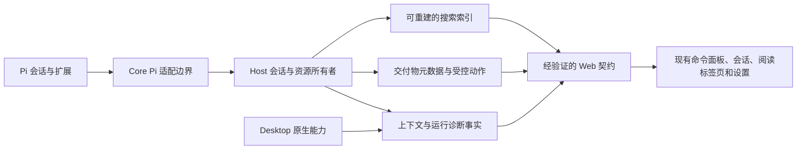

# Ling 竞品源码与产品分析

分析日期：2026-10-02。Ling 基线：0.1.10，提交 `af2670f9e86974311e72f8f4c296eea8836a75c1`。本文覆盖 Maka、DeepSeek Harness、T3 Code、ZCode、pi-gui 的功能、执行与数据架构、扩展机制、交互设计，以及适合 Ling 的具体增量。优先级和方案均为设计建议，不表示功能已经实现或排期。

## 1. 决策摘要

Ling 最值得投入的方向，是把 Pi 已经产生的信息变得可查、可解释、可交付，把使用过程中的中断变得可恢复。现阶段的主要机会集中在表现层和派生数据层，无须另造 Agent 执行引擎。

| 优先级 | 建议 | 用户直接得到什么 | 关键约束 |
| --- | --- | --- | --- |
| P1 | 会话正文搜索与消息定位 | 找到以前的结论、报错、方案，并直达原消息 | 中文短词可用；不靠挂载整份历史搜索；搜索不唤醒所有 Pi worker |
| P1 | 会话交付物入口 | 报告、图片、生成文件集中可见，并能返回产生它的回合 | 首版明确打开当前文件；需要历史版本时再引入快照存储 |
| P1 | 上下文与缓存解释 | 看懂何时会压缩、缓存信息是否可用、数字来自哪里 | 以 Pi 公开数据为准；推算必须标明；不把缺失值显示为零 |
| P1 | 现有诊断页增加资源归属与操作时延 | 能回答哪个会话、进程或操作导致卡顿，为什么还驻留 | 按需采样；区分 JS heap、RSS、CPU、逻辑 I/O；不做全局常驻监控面板 |
| P1，先做两个实例 | 结构化扩展卡片和有限面板 | 测试结果、交付物等有一致、可操作的界面 | Pi 仍拥有扩展运行；Ling 验证来源、动作和生命周期 |
| P2 | 显式草稿暂存、可撤销轻操作 | 暂放一段需求，恢复时不覆盖当前草稿；误归档可撤回 | 复用现有草稿与会话操作所有者；文件回退不伪装成轻量撤销 |
| P2 | 执行呈现密度与计划审阅 | 长工具链更容易扫读，计划有清楚的待答复状态 | 保留原始结果入口；计划需绑定真实 Pi 扩展请求 |
| P3，独立验证产品需求 | 浏览器预览与元素引用、扩展自带完整页面 | 在页面上指出要修改的元素；提供复杂专用工作面板 | 原生隔离、Web 能力差异、资源预算及扩展 API 兼容成本较高 |

P1 表示建议优先验证的增量，不是已发现的 P1 缺陷等级。最先交付正文搜索；交付物与结构化卡片共用一个数据展示契约；上下文解释、诊断改进可以独立推进。完整插件前端平台和浏览器工作台应以真实使用场景证明价值。

## 2. 样本与证据边界

### 2.1 固定源码快照

五个项目均已实际克隆到仓库的 `tmp/`。以下为本次默认分支的固定提交；版本来自对应 package.json，不代表发布渠道上的最新版安装包。`zocde` 对应 ZCode，DeepSeekharness 对应 DeepSeek 官方 TypeScript 仓库。

| 项目 | 仓库 | 本地目录 | 分支 / 版本 | 完整提交 | 许可证 |
| --- | --- | --- | --- | --- | --- |
| Maka | [apache/maka](https://github.com/apache/maka) | `tmp/maka` | main / 0.2.0 | `c7fa6bb6a5f3731f1f591dbeb60433fba79ccb6e` | Apache-2.0 |
| DeepSeek Harness，简称 DSH | [deepseek-ai/deepseek-harness](https://github.com/deepseek-ai/deepseek-harness) | `tmp/deepseek-harness` | master / 0.2.0-rc.2 | `639ed015397290b3745d163aafe02ffee4aa3f84` | MIT |
| T3 Code | [pingdotgg/t3code](https://github.com/pingdotgg/t3code) | `tmp/t3code` | main / server、desktop 0.0.44 | `54084ae1e6c32809db040e4fa571c80fdf2d8ae4` | MIT |
| ZCode | [zai-org/ZCode](https://github.com/zai-org/ZCode) | `tmp/zcode` | main / 3.14.3 | `29628c9acdb81b703bbd4080c207a0e7ce5e276e` | Apache-2.0 |
| pi-gui | [minghinmatthewlam/pi-gui](https://github.com/minghinmatthewlam/pi-gui) | `tmp/pi-gui` | main / 1.0.1 | `51bed8d0ddee047ae84873149cb3bd89ee633a61` | MIT |

克隆使用浅历史，足以复核当前实现，不适合据此判断完整演进史。五个源码工作树检查均无跟踪文件修改。`tmp/` 被 Git 和 Ling 根级 ESLint 扫描排除，竞品代码及其构建依赖不进入 Ling 发布内容。

### 2.2 如何阅读结论

- **源码确认**：读取实际调用链、状态所有者、契约或存储实现。可以证明行为如何设计，不能证明所有环境中都运行成功。
- **执行确认**：运行指定源码或真实界面流程。本次包括 DSH 实际搜索建表代码的中文匹配探针，以及 pi-gui 的本地构建、隔离启动和实际点击。
- **设计建议**：从当前实现和 Ling 边界推导的产品取舍，明确列出实现与验收条件。
- **未验证**：五个竞品的完整模型回合、扩展安装生态、跨平台打包、生产规模性能。本报告不给未经同机同负载测量的速度、内存或包体排名。

文中的代码引用固定到上表提交，文末证据索引列出具体文件和关键符号。功能矩阵里的“本轮未确认”表示证据不足，不表示产品没有该能力。

## 3. Ling 的实际基线：哪些能力已经存在

| 能力 | 当前源码事实 | 本轮值得讨论的增量 |
| --- | --- | --- |
| Pi 与扩展运行 | SDK 直接嵌入；Pi 包、资源、项目信任和扩展替换规则由适配层承接；业务运行在 Host/Core，Desktop 负责原生壳 | 扩展结果的结构化展示协议，不替换 Pi 运行体系 [L1] |
| 会话搜索 | 命令面板匹配标题、项目名和有限 preview；选择后进入会话 | 对完整正文建立派生索引，并提供稳定消息定位 [L2] |
| 历史加载 | 分页、快照与实时消息合并已有 runtime/generation/revision 隔离和加载协调 | 搜索结果按锚点加载，复用已有历史所有者 [L3] |
| 消息流性能 | 已有批处理器；同 ID 的完整消息更新可替代旧更新，依赖顺序的 delta 保留；每会话和全局队列有界 | 测量输入到绘制的等待与主线程工作，不能把“加节流”当作新方案 [L4] |
| 排队消息 | 已支持编辑、删除，以及 follow-up 提升为 steer；修改带 revision/text 检查 | 提高运行状态与下一步动作的可读性，不再增加另一份队列 [L5] |
| 草稿与阅读区 | 草稿持久化、会话专属阅读状态、现有文件和工具标签页 | 明确的多草稿暂存入口，以及配置引导后返回原位置 [L6] |
| 上下文与用量 | 已显示上下文占比、窗口、费用、cache read/write、模型和工具用量；压缩后旧用量不继续冒充当前上下文 | 补齐压缩阈值、缓存有效性、数值来源及可解释性 [L7] |
| 插件页面 | 已展示包及其资源、启用状态、路径和加载结果；资源变更走共用重载所有者 | 将“已安装、已发现、已启用、当前会话已生效”表达清楚，保留部分失败 [L8] |
| Pi UI | 已适配状态、widget、header/footer、通知、终端式 customPanel 和提示请求 | 有界的结构化卡片；完整任意 JS 页面是另一项能力 [L9] |
| 变更审阅 | 已有按执行捕获的变更、Diff、批注、文件审阅状态及反向补丁回退 | 展示回退影响范围、冲突和可恢复状态，不增加平行 checkpoint 系统 [L10] |
| 诊断与驻留 | 已有 Pi worker 的 heap、事件循环延迟、请求数、运行状态，以及空闲会话回收协调 | 全应用资源归属、驻留原因、按钮响应链路 [L11] |
| Todo、问题、后台与定时任务 | 已有各自执行与展示所有者，七项内置能力有统一开关边界 | 统一结果导航和待处理提示，不再建立通用“任务中心”重复状态 [L1] |

这里最大的架构优势是数据与运行职责已分开：Pi 拥有会话执行，Host 拥有项目与业务协调，Web 拥有表现，Desktop 拥有原生能力。新功能必须增强这个分工，而不是让 renderer 再保存一套“真实执行状态”。

## 4. 架构比较：应学习什么，以及要付出什么

| 项目 | 执行权威与持久化 | 扩展边界 | 对 Ling 最有价值的部分 | 整体移植的代价 |
| --- | --- | --- | --- | --- |
| Maka | 自有 runtime；canonical runtime event 与 SQLite 运行记录，向消息、操作和 trace 投影 | Plugin kernel 的有生命周期实例、能力注入与 client bridge；多 UI slot | 一个事实源、多种读视图；取消与恢复状态显式化 | 会替换 Pi 会话语义，并带入一套插件生命周期 [M1][M3] |
| DSH | 自有 Agent loop 和 append-only session events；model surface 可替换，人类历史保留来源 | Cordis 服务与前端 slots；工具、UI、查询、计划、目标等分别组合 | 模型上下文与人类记录分开；交付物和计划成为可导航实体 | 配置、依赖注入、跨端插件、存储均成为另一套平台 [D1][D5] |
| T3 Code | ProviderAdapter 对接不同外部 Agent；命令、事件、投影和 receipt 形成协调层 | 按 provider 声明中断、压缩、回退等能力 | 命令结果可对账；能力诚实；流订阅有完整容量预算 | Ling 当前只有 Pi SDK 权威，加入多 ProviderAdapter 会改变产品定位 [T1][T2] |
| ZCode | 桌面/服务/UI 加自有 zcode-cli Agent；会话索引、工作流、版本化产物分属各自所有者 | 插件组件与执行时配置；工作流产物协议；较丰富的原生工作台 | 产物版本与按需读取、资源可归属、浏览器元素引用 | 原生浏览器、Office 预览、工作流及自有 Agent 带来显著维护面 [Z1][Z3][Z7] |
| pi-gui | Pi SDK driver、runtime supervisor 与桌面宿主；从 Pi branch 映射消息和用量 | Pi events 注册桌面 view；结构化卡片；隔离 iframe + 受控 bridge | 与 Ling 最近的参考：保持 Pi 权威，同时提供更丰富 GUI 表现 | Electron main 中的 view 与 IPC 不能直接成为 Ling 的跨壳业务协议 [P1][P2] |
| Ling | Pi SDK + Core adapter；Host 协调，Web 共享客户端，Desktop 原生壳 | Pi 官方扩展机制、内置适配、经过验证的结果 provenance | 保持会话、资源重载、传输与原生能力各自唯一所有者 | 新功能增加派生索引与展示契约即可；避免引入第二执行源 [L1] |

建议的新增能力分布：

### 4.1 以模块隐藏的复杂性判断设计，而非文件数量

好的边界应让调用方只说明意图：搜索并返回可定位结果、打开会话所属文件、请求某个扩展动作。索引更新、取消、过期检查、文件权限和资源释放由一个所有者处理。Maka 的 client bridge、T3 的命令处理事务、pi-gui 的 view owner 都有这种价值，但它们隐藏的问题不同，不能合并成一个巨大“万能 AgentService”。

设计审查的删除测试是：删除某个中间层后，调用方是否仍只需做同样的事？如果所谓 SearchService 只是转发另一个 SearchManager，没有承担取消、索引覆盖率、游标或失效管理，就不应同时存在两层。反之，frame 连接代际、订阅容量、回退前置校验等实际承担生命周期或正确性的边界，不因代码较多而成为删除候选。

### 4.2 即时反馈与正确结果是两次不同的承诺

T3 的处理链把 event append、projection 和 command receipt 放在同一事务中，提交后才广播事件并完成响应。这值得转化为 Ling 的交互规则：按钮立即给出“操作已开始”的反馈；“已保存、已重载、已完成”由权威结果确认。保存成功但重载失败必须显示两部分，不能一个绿色 toast 结束整个流程。[T2][L8]

Ling 无须为此采用 T3 的全部 event sourcing。对于已有持久化与 Pi 调用，优先保留原有请求和 revision 语义，增加足够的阶段状态；只有可重试且存在真实重复执行风险的动作，才评估 command ID 和幂等回执。

## 5. 五个项目的深入判断

### 5.1 Maka：会话检索、恢复决策与有生命周期的扩展

**搜索结果的单位有价值。** SearchModal 接收的 passage 包含 sessionId、turnId、anchorMessageId、消息上下文、匹配词和分数，结果天然是“某个会话中的某个位置”。前端为每次查询建立 requestId 和 generation；取消会立即结束等待，并尝试通知后端取消。runtime 候选收集还区分运行记录和旧会话记录，不能只读其中一个就宣称覆盖全部历史。[M2]

需要谨慎的是，搜索返回类型有 gaps 和 searchedEverySession，不等于界面已经清楚展示覆盖缺口；本次读取的 SearchModal 消费路径不足以证明这两个字段向用户完整呈现。Ling 应把“仍在索引、部分文件读取失败、仅搜索指定项目”列为 UI 必须处理的状态，而不是仅加到 DTO。

**恢复按钮来自运行态判断。** Composer 只有在没有可发送草稿、没有 streaming、没有导入或恢复中的冲突，而且 Host 提供恢复能力时，才把主动作显示为 resume。恢复控制器查询 plan，再由服务启动并处理不适用原因。它区分“继续一个可恢复运行”与“再发一句继续”。[M4]

Ling 可保留这个动作决策方式：发送、停止、回答问题、提交计划反馈、恢复运行不能只靠一个 isLoading 布尔量切换。是否能恢复必须由 Pi 可支持的具体状态提供，不得借助自动发送提示来伪造底层恢复，尤其不能自动重放可能已发生的工具副作用。

**扩展生命周期值得学习，整套平台不值得接入。** Plugin kernel 对实例维护加载、活跃、失败、卸载等状态，bridge 对 RPC/流调用提供 schema、AbortSignal 和销毁归属；UI slots 分布在 sidebar、settings、conversation、composer 等区域。[M3] 它适合一个拥有自建 runtime 的平台，却会给 Ling 增加第二套插件运行规则。Ling 应把一致性要求放进现有 Pi 适配与 resource reload 边界，只允许少数明确展示位置。

**草稿与预览的细节。** Maka 的 composer draft 层有会话重命名/迁移、内存保留边界及可选持久化端口；artifact 预览注册器区分 MIME 和解码预算。[M5] 值得重视的是“状态是谁的、超过上限怎么办、什么时候释放”，而非增加通用 hook 数量。Ling 已有持久草稿，应该复用并补足特定跨页面路径的验收。

### 5.2 DSH：模型视图、人类记录和交付物分开建模

**上下文裁剪不等于删除用户历史。** Session surface 的 append/replace 投影按 SessionSeq 处理；模型看到的内容可以被替换，原 append 记录仍是人类时间线的重要来源。[D1] 对 Ling 的启发是明确区分三件事：完整会话记录、当前送给模型的内容、当前屏幕已加载的内容。上下文压缩后，不应让历史搜索误以为原消息已消失；搜索索引也不能只取“当前模型表面”。

**搜索是派生存储，不是第二份原始会话。** DSH 的 session-query-sqlite 有 application_id 和 schema 管理，持久 FTS 文档与 live 文档分开，搜索契约带 cursor 和取消信号。[D2] 这种结构适合冷历史加实时增量，但 tokenizer 必须依据 Ling 的语言场景选择。

实际运行 DSH 的 `openSearchDatabase(':memory:', 'wal')` 建表函数，插入一条文本“自动下载更新”，并用其 MATCH 字面量方式查询，结果如下。这是建表与匹配语义的执行证据，不是对整个 DSH 搜索 UI 的性能结论。

| 查询         | 命中数量 |
| ------------ | -------- |
| 自动下载更新 | 1        |
| 下载         | 0        |
| 自动下载     | 0        |

该表使用 FTS5 unicode61；查询层将输入安全地包装成字面短语。它没有因此自动获得中文子串检索能力。Ling 的验收必须包含“下载”命中上述句子、两字短词、文件路径、大小写和标点。可评估 CJK n-gram 候选索引加原文校验，不能只选择 trigram 后遗漏两字查询，也不能默认整库 LIKE 在大数据量下足够快。[D2]

**交付文件成为正式结果。** tool-present 对文件数量、cwd、存在性和普通文件属性做检查，只有工具执行成功才写入 deliverables/presented 记录。PresentedFileCard 把预览、打开、显示所在位置分成不同动作，并对操作中的状态和失败给出反馈。[D3] 这使用户不必从文本中的若干路径猜哪一个是最终产物。

其记录引用当前文件，不复制文件字节。文件后来被修改，打开的也会是新内容。因此 Ling 首版可用这种轻量语义，但必须把它称为“当前文件”；如果产品承诺“那一轮交付时的版本”，就需要 ZCode 那样的版本存储，不能用同一个字段含糊覆盖。

**密度可配置，行为不能含糊。** presentation-policy 将 compact、standard、detailed、verbose 映射到折叠完成结果、分组、运行细节和思考预览等具体策略。[D4] Ling 可先选择“简洁/详细”两种清晰预设，保持错误、待审批和待回答内容可见，避免四个近似名称让用户猜差别。

计划通过回合尾部的卡片打开阅读区，等待审阅时有独立入口；GoalBar 只在存在有效目标时出现，状态变化和异步操作与 goal identity 绑定。[D6] 对 Ling，计划审阅可以是既有问题/扩展请求的专用视图；目标自动续跑则涉及预算、停止、恢复和副作用，不能因为有一个好看的 GoalBar 就直接纳入。

**动态 UI 能力强，但不是安全隔离证明。** DSH 的 client slots 和 Cordis client runner 能注入前端逻辑；evaluator 使用动态 Function，并给代码提供受控的便利 API。[D5] 遮蔽若干 ambient global 不等于浏览器进程隔离。Ling 更适合先使用结构化数据与受限动作；任意前端代码应进入独立的隔离设计，而不是在主 React 树里执行。

### 5.3 T3 Code：命令可对账、输入不丢失、实时流有边界

**跨 Agent 能力差异是契约。** ProviderAdapter 明确表达模型能否在会话内切换、能否无提示续跑、能否回退会话、采用原生压缩还是 slash command。[T1] 可吸纳的是能力表达：当 Pi 不支持某个操作时，UI 提供原因和替代入口；不可吸纳的是为了对齐一个菜单而在 GUI 中模拟未支持能力。

**完成不是“按钮回调跑完”。** OrchestrationEngine 对 commandId 的目标冲突、已有 receipt、事件保存、投影和确认进行统一处理。[T2] Ling 的 Pi 设置、扩展资源变更尤其需要这一思维：用户必须知道选择是否保存、当前会话是否生效、后台会话是否延后刷新，以及部分失败是否需要重试。

**流优化保留语义边界。** ThreadLiveEventCoalescer 的默认窗口为 50ms，只把同一 turn/toolCallId 的 tool.updated 归并为较新的状态；遇到其他事件先刷新，缺失稳定 ID 的事件保留。LiveStreamBudget 的默认边界是每订阅 1,000 项、8MiB 序列化字节，连等待 RPC ACK 的批次也算在内；溢出要求从已收到序号恢复，而不是悄悄丢事件。[T3]

这套实现的重点不是 50ms 这个数字，而是“可合并状态、不可丢增量、顺序屏障、在途消息也占预算”。Ling 已有消息 batcher，不能再叠加一层固定延迟。下一步应测量真实瓶颈，并审查慢客户端与重连是否有等价的完整预算和恢复语义。[L4]

**草稿暂存是一个完整交互，而非多存一段字符串。** PromptStashStore 限制 20 个条目，处理文本、文件引用和图片保存；图片缺失、无法读取或未持久化会成为显式状态。菜单支持键盘、删除后的焦点位置及恢复操作。[T4] 其 localStorage 容量策略不适合原样落到 Ling；Ling 应使用现有 Host 持久化路径，保持附件引用与文本的一致性。

**主按钮表达“下一步”。** ComposerPrimaryActions 将待回答问题、计划实现/修改、运行中停止、连接不可用等状态分别呈现。[T5] 可以学习的是用户行动优先级：有待答问题时，焦点和主动作应服务答复；正在运行时，停止始终可达；输入新文本不应被一个不相关 loading 锁死。

**回退有两种事实。** CheckpointStore 通过 VCS 能力保存工作树快照并恢复文件；ProviderAdapter 的 conversation rollback 是另一种能力。两者不能相互替代。[T6] Ling 已有反向补丁，应把“文件会改变什么、对话会发生什么、后来手工修改是否冲突”写清楚。轻量归档撤销还需要过期 action token，避免旧 toast 撤销新的用户操作。

资源归属代码记录组件/操作维度的逻辑读写次数和耗时，适合定位热点，但这不等于 OS 真实磁盘流量或进程 CPU。[T7] Ling 的诊断页应保留这些指标的量纲与来源。

### 5.4 ZCode：面向成果的工作台与可观测原生能力

**命令中心将用户意图区分开。** CommandCenterDialog 用命令、会话、文件三类搜索组织结果，并显示会话内的片段；会话内查找有预加载和逐段定位逻辑。[Z2] 对 Ling，最有价值的不是记忆特殊前缀，而是将“跳到一个会话”和“找到一句话”作为两种结果展示，普通用户通过可见范围选择也能使用。

其会话索引对 title/searchable_text 做 LIKE，同步层最多保留 200,000 字符并筛选可见 user/assistant 文本；时间线查找的自动预载边界为 1,200 行。[Z2] 这些是明确的资源取舍，不可称为无限完整搜索。片段匹配和 snippetIndex 也不如稳定消息 ID 适合定位重复文本。Ling 应把覆盖范围、稳定锚点与索引完整性放进契约。

**版本化交付物实现了更强承诺。** workflow-artifact-publish 校验文件与请求，读取字节，发布到存储，再返回带 version、contentType、bytes、uri、sourcePath 的记录。UI 按需分块取数据，限制读取量，版本切换和卸载释放 object URL；PDF、PPTX、Office 预览按需加载。[Z3] 这种方式能回答“第 2 版报告是什么”，代价是保留策略、磁盘预算、版本清理、导出和格式维护。

因此建议 Ling 先做会话交付物集合，明确 current-file 与 snapshot 两类来源。首版只启用前者，数据契约为后者保留可区分的类型；等用户实际需要历史产物复看，再引入字节快照。不要把 Office 全格式支持设为交付物功能上线前置条件。

**资源管理器的生命周期值得保留。** ResourceManagerApp 仅在相应页面订阅采样，默认 1 秒刷新，避免同一采样请求重入，退出后停止并忽略迟到结果；存储页面不持续采 CPU/内存。[Z4] 对 Ling 可落实为诊断页展开时采样，默认按进程/会话归属聚合，闭合后释放。不应为了“可观测”反过来拖慢应用。

**上下文拆解必须承认估算。** context-usage-breakdown 能按工具 schema、skills、消息角色等归类，但运行时也有 estimated、tokenMethod、confidence 和估算版本字段。[Z5] 有拆解图不代表精确知道服务端实际 token 数。Ling 的面板应分别显示 provider 回报、Pi 状态、客户端估算，不把三种数值加成一个看似精准的总数。

**浏览器元素引用有实际产品价值。** UnifiedBrowserView 维护 webview guest 的显示与会话归属，通过原生侧连接调试接口；元素引用包含页面、选择器、附近文本、位置和样式，并生成有界上下文。[Z6] 对前端开发来说，“点中按钮并附带信息”比只发截图更可操作。它同时带来导航策略、guest 生命周期、跨域页面、桌面权限和 Web 端支持差异，需要作为独立项目验证。

有两处必须避免误读：旧 PluginsService 已显式标记 retired，当前插件路径在 zcode-cli bootstrap/adapters；`@zcode/cua` 包在本快照中是 API 形状占位，调用抛 unavailable，不能算已验证可用的完整桌面控制能力。[Z7][Z8]

### 5.5 pi-gui：最接近 Ling 的表现层参考，同时有可复现的反例

**声明式卡片先于任意页面。** 扩展可用 Pi custom entry 声明卡片，GUI 解析 title、tone、rows 和固定动作；动作类型包括打开文件、写入输入框、打开链接、调用扩展命令、进入会话。界面显示动作目标；composer 动作只加入文本，交由用户发送。解析失败的卡片有解释性输出，而不是一片空白。[P1]

这很适合 Ling，但应补足 provenance 和完整资源边界：本次读取的卡片解析函数对动作数设为 8，却未同样限制 rows 数量与 title/subtitle 文本。Ling 的契约必须在信任边界对总字节、行数、文本和动作分别有实际预算；不能仅因卡片格式固定就视为输入天然有限。

**桌面扩展 view 有完整生命周期。** 扩展通过 Pi events 注册声明，前端资源必须匹配实际已加载扩展的文件身份并限定在其资源根中；owner 按 session/generation 维护 runtime、连接与销毁。前端在 sandbox="allow-scripts" 的 iframe 中，CSP 禁止直接网络连接、嵌套 frame 和 worker，通过 bridge 与宿主交互。[P2]

这个隔离约束只覆盖前端页面；backend facet 仍是可信扩展代码，不等于整个插件被 OS 沙箱化。Ling 若做同类功能，Host 应拥有目录与连接授权，Desktop 仅提供需要的原生操作；Web 应通过现有认证协议获得同样的业务能力，而不是依赖 Electron 专属 IPC。

**上下文面板读取 Pi 真实能力。** SessionUsage 从 getSessionStats、compaction settings、cacheWarmingStatus 与当前 branch 汇总信息；ContextMeter 把压缩阈值、缓存、用量、plan limits 聚在一个按需出现的面板中，倒计时只在面板打开时刷新。[P3] 这比增加独立常驻仪表盘更贴合 Ling。

缓存到期由模型 TTL 和最近请求时间推算；相关 TTL 逻辑还镜像了 Pi 非导出的实现。plan limit 则来自 HTTP 响应头，源码明确指出 WebSocket 通道可能没有对应事件。Ling 应吸收展示意图，并在 SDK 适配边界验证当前公开能力，不能将推算视作 provider 实时保证，也不能让没有响应头的数据源显示“额度正常”。

**查找策略有长会话风险。** 会话内查找启用 searchMode 后把全部 layout 行放进 placements，再用 TreeWalker 遍历文本节点、替换 DOM 插入 mark；输入有 150ms debounce。[P4] 这能实现可见文本高亮，但意味着搜索时绕开平时的虚拟化收益，且 DOM 扫描与 React 更新需要协调。本次没有长历史运行性能数据，因此结论是“实现存在放大工作量的路径”，不是声称测得某个卡顿值。Ling 应采用数据索引和目标行定位。

**实际 UI 验证发现配置引导丢失任务连续性。** 在空凭据、隔离目录的真实构建里，New thread 清楚显示 No models available，Start thread 不可提交，并提供直达 Providers 的按钮。输入 `UNSENT_REVIEW_DRAFT_20261002`，确认输入区实际值后进入 Providers；Back to app 返回 workspace 页，再打开 New thread，输入为空。源码中新会话 openSurface 调用 resetSurface 并清空 prompt/attachments，与观察一致。[P5]

这个反例的适用范围是该提交的新会话引导路径，不是对所有已存在会话草稿的判断。Ling 的对应验收应要求返回到原 Composer、保留文字和附件并恢复焦点；配置是否完成与草稿保留是两个独立条件。

## 6. 功能横向比较与增量判断

这张表比较本轮读到的具体实现，不给项目综合打分，也不把未审阅的能力记为缺失。

| 观察项 | 已确认的竞品实现 | Ling 判断 |
| --- | --- | --- |
| 搜索正文并定位 | Maka passage 带消息锚点；DSH 派生 FTS；ZCode 会话片段与时间线查找；pi-gui DOM find | 明显增量，优先做完整数据链路；不要复制各自的覆盖限制 [M2][D2][Z2][P4] |
| 交付物集合 | DSH 成功工具结果登记文件；ZCode 存储字节与版本 | 明显增量，两种文件语义必须区分 [D3][Z3] |
| 上下文说明 | pi-gui 压缩阈值、缓存和套餐；ZCode 分类与置信度 | 在现有用量入口扩展，不新增重复 dashboard [P3][Z5][L7] |
| 扩展卡片 | pi-gui 数据卡片和封闭动作集 | 与 Ling 高度契合；增加来源校验和边界预算 [P1][L9] |
| 扩展完整页面 | pi-gui sandbox frame；Maka/DSH UI slots | 后续能力；先用两类真实面板证明需要，别先造平台 [P2][M3][D5] |
| 多份待发内容 | T3 显式 stash，处理附件失败与恢复 | 与自动保存当前草稿不同，可补充 [T4][L6] |
| 主按钮动作语义 | Maka resume 条件；T3 问题/计划/停止状态 | 提炼统一动作优先级，复用 Ling 队列与审批状态 [M4][T5][L5] |
| 计划阅读与答复 | DSH 计划卡片、阅读区和待审阅入口 | 可作为专用呈现；不自动引入另一套 Todo 或执行计划 [D6] |
| 持久目标与自动续跑 | DSH GoalBar 对接目标快照和进程内激活状态 | 产品方向改变较大，需预算、停止和恢复设计；暂后置 [D6] |
| 运行细节密度 | DSH 声明式 presentation policy | 小范围提升，始终保留失败与待操作内容 [D4] |
| 资源与延迟可观测 | ZCode 按需进程采样；T3 操作级逻辑 I/O | 扩展既有 Diagnostics，不增加“清理一切”按钮 [Z4][T7][L11] |
| 文件与会话回退 | T3 VCS checkpoint 与 provider rollback 分离 | 强化 Ling 的影响说明与冲突展示，避免双写快照 [T1][T6][L10] |
| 元素拾取 | ZCode browser guest 和结构化元素上下文 | 对前端工作有潜力，原生与 Web 边界需独立验证 [Z6] |
| 插件资源生效 | Maka/DSH 生命周期；ZCode 当前插件组件清单；pi-gui Pi 声明注册 | Ling 已有 catalog/reload，优化生效状态与来源说明即可 [L8][M3][Z7][P2] |
| 定时、Todo、问答、后台任务 | 各项目组织方式不同，本轮未逐一验收全部执行器 | Ling 已有能力，不以菜单数量驱动扩张 [L1] |

## 7. 可直接进入设计与实现评审的方案

### 7.1 正文搜索：一次查询，两个入口，共用一份索引

**用户路径。** 命令面板保留快速进入会话的功能，增加清楚的“搜索消息”范围；当前会话提供 Mod+F 的查找条。项目范围搜索默认限制在当前项目，跨项目由用户显式切换。输入后显示片段、项目/会话、时间和命中类型；按 Enter 进入原消息，Esc 返回输入或原阅读位置。

**展示设计。** 顶部一行负责查询和范围，结果按会话分组，每项最多展示两三行摘要；键盘上下移动不立即切换会话，确认才导航。选择结果后先确定会话，再加载锚点附近页；目标消息短暂描边，不展开全部工具结果、不重置原会话草稿。后台新结果不得把用户已选条目顶走。工具正文和思考内容作为显式可选范围，避免默认噪声和超大输出主导结果。

**契约与数据所有者。** Host sessions 域拥有可重建索引；读取 Pi 会话数据仍经过 Core Pi adapter，Web 不解析 Pi JSONL。索引按 cwd、sessionId、持久 entryId 与内容版本去重。命中应包含消息锚点、摘要、匹配范围、来源类型；响应还需要 cursor、索引 revision、覆盖状态和局部错误。返回摘要不等于把完整工具输出复制进 renderer。

**分支和实时状态。** 默认搜索每个会话当前可读分支，并清楚标识范围；若开放所有历史分支，命中非当前分支不能自动改动正在运行的 Pi 分支。先提供只读定位或显式分支操作。尚未持久化的实时消息可以作为有界 overlay，其临时 ID 在 messagePersisted 后合并为 entryId；不能在每个 token 到来时写一次数据库。

**中文与规模。** 先以受限项目集合实现正确的字面量搜索，再用真实语料比较 CJK n-gram、英文词索引和有界回查。两字中文、Windows 路径、正斜杠、引号和标点必须保持用户预期；关键词不能变成 SQL/FTS 指令。索引只保存可搜索文本和定位元数据，不读取凭据文件或复制附件二进制；正文可能含敏感信息，派生索引沿用原会话的本机访问边界和清理语义。索引范围限定为用户纳入 Ling 的项目与可读会话，冷历史读取不应触发项目扩展执行。

**恢复与取消。** 初次索引、部分坏文件、旧版本索引和取消分别有状态；取消同时解除界面等待与后端工作。损坏可重建的是派生索引，原会话不可删除。查询完成时核对请求身份，项目切换后不接收旧结果；后台索引采用低并发，不抢占交互与模型执行。

**验收。** “下载”能命中“自动下载更新”；相同文本出现在十条消息中仍定位到正确 entryId；未加载的较早消息可达；切换项目、压缩、fork、删除源会话、重建索引后结果语义一致。10,000 条消息的查找不得把 10,000 行 DOM 全部挂载。性能以候选构建上的输入延迟、首批结果时间、索引耗时和磁盘量分别记录。

### 7.2 交付物：会话的成果入口，不是第二个文件管理器

**入口。** 完成回合显示紧凑文件卡片；有交付物时，阅读区新标签页工具列表提供“交付物”。该页按回合或最近更新时间排列，点击沿用现有文件 viewer；“返回消息”回到来源回合。没有交付物时不在左侧增加长期空入口。文件树仍承担浏览项目全部文件的职责。

**登记规则。** 首版通过明确的发布动作登记文件，来源可以是经过验证的 Pi 扩展结果或用户手动加入；不扫描每条 Markdown 链接并擅自判定“交付完成”。元数据包含所属 SessionRef、源 entryId/toolCallId、项目相对路径、标题、媒体类型、登记时间和来源种类。文件 I/O 与校验属于 Host 文件边界，不能把任意绝对路径作为可直接打开的能力。

**文件语义。** current-file 指向当前项目文件，显示“当前文件”；缺失、超限、类型不支持、内容有更新分别说明。snapshot 必须在读取并发布字节成功后才产生版本，不复用当前文件 URI。快照与原文件脱离后需要明确保留期、空间上限、导出与清理机制；只有用户确认需要版本能力时进入这一阶段。

**预览预算。** Markdown、纯文本、图片复用已有展示；其他格式给出系统打开/下载入口，按需加载额外 viewer。大文件打开前知道体积，取消能终止读取；切换会话释放不再需要的解码内容和 object URL。HTML 产物不在主应用权限下执行脚本。

**验收。** 一轮发布两个文件，重启后仍能定位到来源消息；随后修改和删除文件，界面正确区分“当前内容变化”与“文件缺失”；失败发布不出现成功卡片。宽窄窗口、80%/100%/150% 缩放、长中文文件名、多次开关面板和无障碍键盘操作均实测。

### 7.3 上下文解释：在已有用量入口回答三个问题

**三个问题。** 现在已使用多少窗口？何时会自动压缩？当前缓存信息能相信到什么程度？已有 composer 用量入口展开一个简短摘要，更多细节进入当前用量页；保留数字和文本，不强制更换成难以精读的圆环。

**数据分层。** Pi 公共 API 提供的 context/compaction/cache 状态由 adapter 映射成不泄漏 SDK 类型的 DTO。每项包含来源、时间和可用性；provider 回报用量、Pi 推导阈值、客户端估算分别展示。缓存倒计时写成“预计”，不同 model/provider 之间不串用上一轮缓存状态。压缩后未收到新用量时显示“等待下一次回复”，不能显示 0% 或旧值。

**进一步的上下文检查器。** 仅当 Pi 提供可准确获取的内容时，展示系统说明、项目资源、skills、工具 schema、历史消息的贡献。拿不到最终请求体时，应明确“资源概览”或“估算”，不标成“模型实际收到的完整提示”。附件、动态扩展注入、provider 包装和缓存处理都可能使估算不等于结算值。

**生命周期。** 倒计时只在面板可见时更新；按回合或状态变更更新事实，不随每个 token 重算整份历史。额度信息延用现有 provider quota 所有者，避免第二套认证与后台请求。

**验收。** 无 usage、压缩后、切模型、HTTP/非 HTTP 通道、provider 不提供 TTL、缓存预热开启/关闭、订阅与按量计费分别检查；关闭面板后不再存在该倒计时订阅。验证时不能用填满数字的假数据代替实际 SDK 缺省状态。

### 7.4 诊断：把“慢”分成可以定位的阶段

**页面。** 扩展设置中的 Diagnostics，先给进程与会话列表，再展开请求和资源细节。普通会话界面只在失败、明显等待或用户主动展开时出现诊断入口。用户关心的是“哪一个任务占用、为什么没有释放、我的操作进行到了哪里”，不是看到一整屏内部模块名。

**指标含义。** Desktop 汇总壳、renderer、GPU 的原生指标；Host 汇总自身、Pi control/session workers 及逻辑操作归属。契约保留 sampledAt、可用性与单位：RSS 不等于 JS heap，逻辑 I/O 次数不等于磁盘吞吐。CPU 百分比明确按单核还是整机归一，缺测项显示未知。Web 模式不显示不存在的原生指标。

**动作时序。** 对慢按钮记录 interactionId 下的输入、即时反馈、请求发送、Host 接收、开始处理、Pi/磁盘结束、结果返回、稳定绘制。先区分主线程阻塞、排队、I/O 和布局测量，再决定优化哪层。记录摘要和时长，不把提示词、认证数据和完整工具正文写入诊断日志。

**驻留原因。** 从既有 retention owner 暴露当前选中、正在执行、等待审批、后台任务、排队或可回收等原因；“释放空闲会话”必须继续经过该所有者。后台扫描不能直接 kill worker 绕过会话清理与未完成交互。[L11]

**采样。** 页面可见时订阅，默认约 1 秒一次可作为候选值；一次未结束不叠加下一次，切换离开后停止。更密集的性能录制应有明确开始、停止和保留上限。

**验收。** 两个会话并发、一个等待审批、一个工具运行中，同时进入/离开诊断页；归属、未知值和保留原因正确。重复开关 30 次后没有累积订阅、采样器和迟到更新；有错误时能重试，不把失败显示为空进程列表。

### 7.5 扩展表现：先收敛数据与动作，再讨论任意前端

**第一阶段的两个实例。** 一个测试运行卡片，包含汇总、失败项、打开失败位置、查看完整结果；一个交付物卡片，包含文件、预览、来源消息。先用实际数据实现这两例，再提取真正重复的 schema、校验和控件。不建立尚无调用者的通用插件 UI 平台。

**最小展示面。** 第一版仅有回合内卡片，以及该会话阅读区的一个可选面板。使用 Ling 现有颜色、文字、surface、焦点和按钮规范。扩展可以声明语义和数据，不能要求替换全局菜单、主题、composer 或 workspace 根组件。

**动作分级。** 打开受控文件、进入来源消息、将建议文本加入草稿是基本动作。可执行的扩展命令须绑定当前会话、当前加载扩展及代际，沿原 Pi/Host mutation 通路执行；不允许卡片提供任意 Host 方法名。写入草稿应先检查当前输入，给追加或显式替换选择，不直接发送。

**持久化与信任。** 原始 Pi 结果与验证后的展示元数据保持关联。来源无法验证、schema 不支持或内容超限时，显示说明并保留 Pi 原结果入口。historical card 不应使卸载的扩展继续获得执行权；动作能力来自当前会话的有效资源状态。

**完整页面的进入条件。** 两个真实扩展都无法用结构化面板表达时，再评估独立 iframe、只读静态资源根、连接认证、消息总量、超时、主题桥和销毁协议。页面按 session/runtime generation 归属，reload、replacement、切换和关闭均使旧连接失效。前端 sandbox 与后端扩展信任要分开说明，能力可以缺省，但不可静默成功。

**验收。** 恶意超长文本/过多行、坏 action、来源不明结果、用户包覆盖内置包、扩展卸载、重载失败和 busy 延迟重载均实测；切换会话后旧按钮不能调用新会话。对自带页面还要验证导航、资源越界、frame 自行刷新和桥接断开时的可见错误。

### 7.6 草稿暂存、撤销与主动作：三项小而完整的交互

**暂存。** Composer 的次级菜单提供“暂存草稿”，成功持久化后才清空当前输入；列表显示首行、附件数和时间。恢复时若当前输入非空，默认保留两者，提供追加或显式交换；图片不可用时明确说明，不丢文字。单会话当前草稿与用户主动创建的暂存条目分别有定义，但共用已有持久化基础。首版优先文本与受控附件引用，不持久化任意大段 base64。

**轻量撤销。** 归档、取消固定等可逆 UI 操作可以提供短时 Undo；动作带会话身份、操作版本和当前结果，用户后续操作会使旧撤销失效。文件回退、工具执行与模型运行不能套用同一个 toast 撤销语义。派生缓存清理也不等于删除原会话。

**主动作优先级。** 当前待回答的问题/审批保持显著；运行中的停止始终可达；有可发送草稿时维持明确发送/排队含义；恢复或实现计划只有底层真实支持时出现。慢操作先反馈，再等待权威结果，不用全局 loading 封住无关按钮。

**验收。** 新会话进入模型设置再返回、附件导入中切换、暂存保存失败、恢复时已有输入、归档后立即重新打开、旧 Undo 在状态改变后点击，均以真实 UI 和重启后的数据为依据。

### 7.7 执行呈现与计划：减少阅读负担，保留控制权

建议从一项密度偏好开始：简洁模式折叠已完成的长工具输出，按回合展示结果摘要；详细模式展开更多过程。错误、审批、提问和正在运行的步骤不因密度设置消失。自动更新摘要不得反复改变已读区域高度；用户手动展开状态属于该会话，不在每次流更新时复位。

计划页面可以复用 Markdown 阅读布局，提供“需要修改”和“按此执行”两个语义明确的动作，绑定原请求 ID 和 revision。文字内容变化后必须重新确认对应版本，旧计划的按钮不得回答新请求。不存在待审阅请求时，计划就是可阅读的历史产物，不额外创造待办状态。

自动目标续跑、预算消耗与工作流编排属于执行能力，应另行评审 Pi 扩展或 Host 调度的所有者。计划卡片的视觉完成，不构成自动执行能力已就绪的证据。

## 8. 页面与交互组织

### 8.1 沿用一个工作台，不增加并列体系

| 位置 | 建议承担的内容 | 进入与退出行为 |
| --- | --- | --- |
| 左侧项目/会话导航 | 当前组织结构、活动、待处理提示 | 不承担复杂过滤和大块产物预览；搜索通过现有入口进入 |
| 命令面板 | 快速导航、正文搜索及范围选择 | 方向键只选中，Enter 确认；取消返回原焦点 |
| 会话正文 | 工具执行、可见错误、结构化结果卡片和原始信息 | 完成卡片尺寸稳定；详情放到已有阅读区 |
| Composer 上方/工具栏 | 待回答事项、队列、上下文摘要、草稿暂存 | 按存在性出现；不把空状态永久占据输入区 |
| 右侧阅读标签页 | 文件、Diff、交付物、计划、扩展面板 | 每工具每会话一个标签；重复打开激活既有标签，保留阅读位置 |
| 设置 | 插件生效状态、诊断、少量全局偏好 | 返回原会话与草稿；不能默认回首页并丢掉用户的工作入口 |

这与 Ling 的现有设计一致：会话选择在左侧，阅读工具在右侧，只有阅读区使用标签。搜索和产物是现有体系中的新内容，不需要另立 workspace/project/task 三级导航。[L6]

### 8.2 四条必须走通的用户旅程

1. **找回以前的结论**：打开搜索 → 选择当前项目 → 输入中文短词 → 看到带片段的命中 → 确认 → 会话切换并定位原消息 → 打开引用文件 → 返回后保留原搜索和阅读状态。
2. **拿走一轮交付物**：看到完成卡片 → 点文件预览 → 查看当前文件/历史版本标识 → 系统打开或下载 → 回到来源回合；文件缺失时仍保留交付记录和解释。
3. **处理一个等待**：运行中状态可见 → 审批/问题到达 → 主动作转向当前待处理事项 → 回答失败保留输入 → 成功后继续真实执行 → 结果与原请求准确关联。
4. **解释一次慢点击**：点击立即反馈 → 请求阶段可见 → 失败有恢复入口 → 需要时打开 Diagnostics → 看到对应会话、阶段和资源归属 → 返回时草稿与阅读位置保持。

### 8.3 动效服务状态变化

这些是待验证的设计参数：普通按钮按压反馈应在下一次可绘制机会出现；结果卡片和浮层用约 120–180ms 的 opacity/transform，关闭或切换可打断；选中背景只在小型、几何稳定的控件组移动。等待超过短暂网络抖动后再出现局部 pending，避免一闪而过的 spinner。

长 Markdown、Todo、工具结果和搜索列表不做随内容变化的高度动画，也不对整块虚拟列表启用共享 layout 动画。缩放和拖动分栏时直接布局与测量，保持锚点；稳定后才允许装饰过渡。reduced-motion 下保留即时状态变化，移除非必要移动。这些原则针对用户已经关注的缩放卡顿和形变，不能只用短空列表验收。

## 9. 性能、包体与长期成本

### 9.1 将成本归到具体能力

| 能力 | 主要成本 | 控制办法 | 需要测量的内容 |
| --- | --- | --- | --- |
| 正文搜索 | 首次扫描、索引磁盘、实时更新、结果定位 | 冷历史只读索引；后台低并发；摘要分页；目标区段加载 | 首批结果、取消耗时、索引体积、主线程长任务 |
| 交付物 | 文件解码、版本字节、viewer 依赖 | 当前文件优先；按需预览；字节上限；快照保留策略 | 首次打开、峰值内存、关闭后保留量、磁盘增长 |
| 上下文解释 | branch 遍历、token 估算、定时器 | 边界更新；派生缓存；仅可见时刷新 | 流式输出期间 CPU、打开面板耗时、隐藏时订阅数 |
| 扩展卡片/页面 | 输入体积、React 树、frame、桥消息 | 有界 schema；少量挂载；按需 frame；释放连接 | 包体增量、消息队列量、长会话节点数、重复开关驻留 |
| 诊断 | OS 采样、跨进程 RPC、日志留存 | 可见性驱动；无重入；数据保留上限 | 诊断开/关的 CPU 差、采样失效、日志体积 |
| 浏览器工作台 | 独立 renderer、页面脚本、截图、调试连接 | 独立预算、休眠/恢复、有限驻留、会话归属 | 单标签和多标签 RSS、切换延迟、后台 CPU、恢复正确性 |

本次 pi-gui 构建实际输出的主 renderer JS 为 3,461.35kB，CSS 为 168.40kB，另有 wasm JS chunk 622.45kB，均为 Vite 报告的未压缩构建体积。它们不能与 Ling 的安装包、Electron 内存或冷启动时间直接比较；本轮没有测出五个竞品的统一包体/性能基线。

### 9.2 候选性能预算，不冒充实测成绩

建议以固定机器、相同构建模式、相同数据集测量 p50/p95，记录样本数和冷/热状态。初始目标可设为：本地按钮可见反馈 p95 小于 100ms；已加载页面切换 p95 小于 150ms；已完成索引的项目搜索首批结果 p95 小于 300ms。数据库初始化、首次索引和模型响应分开统计，不混入“按钮响应”后用平均值遮蔽阻塞。

这些目标需要用真实候选校准。测试至少包含长中文、10,000 条消息、超长单条 Markdown、连续工具输出、多个会话和低宽度窗口；仅跑浏览器网络快照或只测函数执行时间不能证明交互达标。优化收益应能解释为减少了哪段等待、哪类重复工作或哪项驻留，而不是“代码少了所以更快”。

### 9.3 新依赖与目录决策

不为搜索再引入前端全量索引库，不为卡片再引入另一套 UI kit，不为简单计划建立工作流解释器。涉及新的 tokenizer、Office viewer 或 frame bridge 时，用可运行样例说明收益，并记录安装包增量、许可证义务、跨平台构建和运行资源成本。

Web 端的新业务组件放在实际功能所有者下，复用 components/ui 与 components/workbench；Host 的派生索引留在 sessions 域，资源登记和动作通过明确依赖接入；Pi 数据读取限制在 SDK adapter；原生进程指标属于 Desktop。只在出现两个真实消费者且边界稳定时抽公共层，不建立只有转发逻辑的 manager/service/facade 链。

## 10. 暂不进入 Ling 的方向

| 方向 | 暂缓理由 | 重新评估条件 |
| --- | --- | --- |
| 引入 Maka/DSH 自有 Agent loop 或完整 Cordis 平台 | 与 Pi 的会话、配置、扩展和生命周期形成双重权威 | 用户明确改变“Ling 是 Pi 表现层”的产品边界 |
| 增加 T3 式多 Agent provider 协调体系 | 当前需求可由 Pi SDK 覆盖，会引入能力矩阵与多种运行语义 | 有必须同时支持其他执行器的真实用户场景 |
| 默认自动提取长期记忆、自动目标续跑 | 改变内容保留与后台执行范围，需单独设计预算、删除、可见性和停止 | 明确需求与可审计执行语义成立 |
| 完整工作流 DSL、通用仪表盘编辑器 | 交付物和计划展示不需要先拥有编排平台 | 多个重复流程证明现有 schedules、skills、extensions 不够 |
| 允许任意扩展替换 Composer、侧栏和全局设置 | 容易破坏快捷键、主题、草稿和跨版本稳定性 | 少量固定展示面无法表达实际场景，并有兼容承诺 |
| 全部 Office 格式同时内置 | 增加包体、解析依赖与大文件风险 | 交付物使用数据证明某个格式的预览价值 |
| 常驻资源面板、常驻目标条、空产物侧栏 | 占据主流程空间并增加后台工作 | 有当前活动或用户显式打开 |
| 对长会话用全量 DOM 查找或对所有增量统一节流 | 前者放大布局成本，后者可能破坏顺序并增加按钮等待 | 不作为默认实现；必须有匹配具体负载的证据 |

## 11. 实施顺序与可复验门槛

### 11.1 分阶段交付

| 阶段 | 具体成果 | 进入下一阶段前的门槛 |
| --- | --- | --- |
| A：查得到 | 正文索引、项目搜索、会话查找、entryId 定位、覆盖状态 | 中文与路径匹配、冷历史定位、取消和索引重建通过真实数据验收 |
| B：拿得走、看得懂 | current-file 交付物、两个结构化卡片实例、上下文与缓存摘要 | 来源可追溯，文件失败可见，原始结果可达，现有阅读与草稿行为不退化 |
| C：慢得有解释、误操作可恢复 | Diagnostics 增量、动作阶段、草稿暂存、轻操作 Undo、密度偏好 | 重复交互、重启、并发执行、缩放和窄窗口验收通过；订阅/驻留稳定 |
| D：由场景驱动扩展 | 产物快照、专用计划页、复杂扩展页面或浏览器元素引用 | 每项独立验证需求、存储/权限/资源成本，不以其他竞品存在为上线理由 |

这不是一次大重构的清单。A、B、C 均可拆成有完整用户旅程的小交付；如果某项必须同时改动多个无关所有者才能成立，应重新检查边界，而不是扩大通用抽象。

### 11.2 实际验收矩阵

| 场景                     | 必须看到的结果                                | 证据形式                                  |
| ------------------------ | --------------------------------------------- | ----------------------------------------- |
| 首次使用无模型           | 解释原因、直达配置；返回保留新会话文字与附件  | 实际输入、点击、返回、重启                |
| 搜索未加载历史           | 定位正确消息；不挂载全部历史；原草稿保留      | 固定数据与消息 ID、界面定位、DOM/性能观察 |
| 搜索坏文件/旧索引        | 完整结果不被单个失败抹掉；覆盖不完整可见      | 隔离损坏样本、重试与重建后的界面          |
| 流式输出中搜索、切换     | 输入不被流量阻塞；迟到结果不串会话            | 同时运行真实回合并录制交互                |
| 产物变更/缺失            | 当前文件、快照、缺失分别有正确文案和动作      | 实际文件修改、打开、重启                  |
| 扩展覆盖与重载           | 用户 Pi 包优先；加载/激活状态真实；旧动作失效 | 真实扩展、工具审批、重载与 replacement    |
| 上下文数字未知           | 未知、估算、已报告明确区分；模型切换不串值    | 真实 SDK 状态与对应 UI                    |
| 草稿暂存失败             | 当前输入和附件保留；失败可重试                | 隔离存储故障与实际恢复                    |
| 归档与旧 Undo            | 新操作不会被旧回调覆盖；当前会话选择一致      | 快速连续点击、切换和等待后操作            |
| 80%/100%/150% 缩放与分栏 | 卡片比例、行高、锚点和焦点稳定，无内容被覆盖  | 同一长会话实际缩放、拖动和截图            |
| 键盘与 reduced-motion    | 所有动作可达；焦点有归属；减少动态偏好生效    | 纯键盘完整流程及系统偏好复验              |
| Diagnostics 重复打开     | 离开停止采样；无重复订阅；失败不是空成功      | 30 次开关、进程/订阅记录、运行日志        |
| Web 与 Desktop           | 业务能力一致；原生专属能力按声明降级          | 两种客户端连接同一隔离 Host               |

非 UI 测试只保护索引游标与失效、持久 ID 合并、取消、边界校验、原子发布、草稿保存失败、动作版本等实际不变量。视觉、布局、动画、按钮和导航使用真实应用验收，不增加 className 断言、快照堆积或“一个文件一个测试”的形式覆盖。

## 12. 本轮实际验证结果与限制

| 检查 | 结果 | 能证明什么 |
| --- | --- | --- |
| 五个远端仓库、克隆与固定 SHA | 完成；五个源码工作树无跟踪文件修改 | 分析可在固定版本复核 |
| 文档引用与研究目录隔离 | 42 组、88 个固定提交文件存在；Markdown 格式通过；Ling 根级 ESLint 不遍历 tmp，正常应用源码仍可检查 | 引用可复核，研究源码不会混入日常检查 |
| Ling 基线及当前能力 | 读取 contracts、Core/Host/Web 所有者与设计文档 | 已有能力和增量建议有实际代码对照 |
| DSH 中文搜索建表探针 | 执行真实 schema；整词命中、指定中文子串不命中 | unicode61 方案在该样本的匹配语义 |
| pi-gui 依赖与桌面构建 | 完成 shared packages、原生通知 helper、main/preload/renderer 构建 | 本机源码候选可构建；不能证明发布包可安装 |
| pi-gui 界面流程 | 隔离应用数据、Pi 目录和 fixture；无模型引导可用；新会话经 Providers 返回后草稿为空；已正常退出并核对研究进程结束 | 对该流程有真实点击证据；不是全量 UI 验收 |
| 其他四个项目的 UI、真实模型回合与扩展安装 | 未运行全流程 | 相应判断为源码分析，不宣称体验或运行可靠性优于 Ling |
| 五方同负载性能、内存、签名与安装包 | 未比较 | 不给性能排名，不把构建 chunk 体积当安装包体积 |

pi-gui 的模型交互没有使用用户凭据，也没有发送模型请求；研究运行使用独立目录。研究应用已退出，源码克隆保留供后续复验。本文交付源码分析与设计建议，不包含 Ling 功能实现、提交或发布。

## 13. 源码证据索引

每组首个链接也是正文编号的目标；其余链接补足调用链和数据契约。链接固定到分析提交，避免后续分支更新改变论据。

| 编号 | 重点 | 固定源码 |
| --- | --- | --- |
| L1 · Ling | 执行、传输、Pi 适配、七项内置能力及资源重载的所有权。 | [architecture.md](https://github.com/tyql688/ling/blob/af2670f9e86974311e72f8f4c296eea8836a75c1/docs/architecture.md) |
| L2 · Ling | 命令面板匹配 title/project/preview；preview 为有限摘要。 | [command-palette.tsx](https://github.com/tyql688/ling/blob/af2670f9e86974311e72f8f4c296eea8836a75c1/apps/web/src/features/workspace/command-palette.tsx)；[session.ts](https://github.com/tyql688/ling/blob/af2670f9e86974311e72f8f4c296eea8836a75c1/packages/contracts/src/session.ts) |
| L3 · Ling | 历史分页、epoch、generation、revision 及加载结果隔离。 | [use-transcript-history.ts](https://github.com/tyql688/ling/blob/af2670f9e86974311e72f8f4c296eea8836a75c1/apps/web/src/features/chat/transcript/use-transcript-history.ts)；[transcript-page-load-coordinator.ts](https://github.com/tyql688/ling/blob/af2670f9e86974311e72f8f4c296eea8836a75c1/apps/web/src/features/chat/transcript/transcript-page-load-coordinator.ts) |
| L4 · Ling | 消息更新批处理、delta 顺序、每会话/全局容量。 | [session-message-update-batcher.ts](https://github.com/tyql688/ling/blob/af2670f9e86974311e72f8f4c296eea8836a75c1/apps/web/src/features/sessions/runtime/session-message-update-batcher.ts) |
| L5 · Ling | 队列编辑/删除、follow-up 与 steer、expectedRevision。 | [queued-bubble.tsx](https://github.com/tyql688/ling/blob/af2670f9e86974311e72f8f4c296eea8836a75c1/apps/web/src/features/chat/composer/queued-bubble.tsx) |
| L6 · Ling | 阅读区与会话的归属、导航/焦点约束、草稿持久化。 | [design.md](https://github.com/tyql688/ling/blob/af2670f9e86974311e72f8f4c296eea8836a75c1/docs/design.md)；[draft-persistence.ts](https://github.com/tyql688/ling/blob/af2670f9e86974311e72f8f4c296eea8836a75c1/apps/web/src/features/sessions/state/draft-persistence.ts) |
| L7 · Ling | 上下文/费用/缓存 UI，以及压缩后旧用量失效。 | [workspace-session-usage.ts](https://github.com/tyql688/ling/blob/af2670f9e86974311e72f8f4c296eea8836a75c1/apps/web/src/features/usage/workspace-session-usage.ts)；[session-usage-details.tsx](https://github.com/tyql688/ling/blob/af2670f9e86974311e72f8f4c296eea8836a75c1/apps/web/src/features/usage/session-usage-details.tsx) |
| L8 · Ling | 包与资源展示、加载状态和公共资源重载路径。 | [plugins-view.tsx](https://github.com/tyql688/ling/blob/af2670f9e86974311e72f8f4c296eea8836a75c1/apps/web/src/features/plugins/plugins-view.tsx)；[plugin.ts](https://github.com/tyql688/ling/blob/af2670f9e86974311e72f8f4c296eea8836a75c1/packages/contracts/src/plugin.ts)；[resource-reload.ts](https://github.com/tyql688/ling/blob/af2670f9e86974311e72f8f4c296eea8836a75c1/packages/host/src/domains/resources/resource-reload.ts) |
| L9 · Ling | 现有 Pi UI 快照、终端式 customPanel、通知与输入契约。 | [session-extension-ui.ts](https://github.com/tyql688/ling/blob/af2670f9e86974311e72f8f4c296eea8836a75c1/packages/contracts/src/session-extension-ui.ts)；[session-extension-surfaces.tsx](https://github.com/tyql688/ling/blob/af2670f9e86974311e72f8f4c296eea8836a75c1/apps/web/src/features/chat/extension-ui/session-extension-surfaces.tsx) |
| L10 · Ling | 变更捕获与反向补丁回退；实际回退包含预校验。 | [change-review-revert.ts](https://github.com/tyql688/ling/blob/af2670f9e86974311e72f8f4c296eea8836a75c1/packages/host/src/domains/review/change-review-revert.ts)；[change-review-capture.ts](https://github.com/tyql688/ling/blob/af2670f9e86974311e72f8f4c296eea8836a75c1/packages/host/src/domains/review/change-review-capture.ts) |
| L11 · Ling | Pi 进程诊断字段、Diagnostics 页和会话驻留/回收。 | [diagnostics.ts](https://github.com/tyql688/ling/blob/af2670f9e86974311e72f8f4c296eea8836a75c1/packages/contracts/src/diagnostics.ts)；[diagnostics-view.tsx](https://github.com/tyql688/ling/blob/af2670f9e86974311e72f8f4c296eea8836a75c1/apps/web/src/features/settings/diagnostics-view.tsx)；[session-runtime-retention.ts](https://github.com/tyql688/ling/blob/af2670f9e86974311e72f8f4c296eea8836a75c1/packages/host/src/domains/sessions/session-runtime-retention.ts) |
| M1 · Maka | canonical runtime event、SQLite 事件/提交视图及持久化。 | [runtime-event.ts](https://github.com/apache/maka/blob/c7fa6bb6a5f3731f1f591dbeb60433fba79ccb6e/packages/core/src/runtime-event.ts)；[runtime-event-persistence.ts](https://github.com/apache/maka/blob/c7fa6bb6a5f3731f1f591dbeb60433fba79ccb6e/packages/storage/src/runtime-event-persistence.ts)；[sqlite-runtime-store.ts](https://github.com/apache/maka/blob/c7fa6bb6a5f3731f1f591dbeb60433fba79ccb6e/packages/storage/src/sqlite-runtime-store.ts) |
| M2 · Maka | 搜索 passage 锚点、取消、覆盖字段与候选来源。 | [search-modal.tsx](https://github.com/apache/maka/blob/c7fa6bb6a5f3731f1f591dbeb60433fba79ccb6e/packages/ui/src/search-modal.tsx)；[recall-candidates.ts](https://github.com/apache/maka/blob/c7fa6bb6a5f3731f1f591dbeb60433fba79ccb6e/packages/runtime/src/recall-candidates.ts) |
| M3 · Maka | 插件实例生命周期、类型化 bridge 与 UI 展示位置。 | [plugin-kernel.ts](https://github.com/apache/maka/blob/c7fa6bb6a5f3731f1f591dbeb60433fba79ccb6e/packages/runtime/src/plugin-kernel.ts)；[plugin-client-bridge-service.ts](https://github.com/apache/maka/blob/c7fa6bb6a5f3731f1f591dbeb60433fba79ccb6e/packages/runtime/src/plugin-client-bridge-service.ts)；[client-plugin-slots.tsx](https://github.com/apache/maka/blob/c7fa6bb6a5f3731f1f591dbeb60433fba79ccb6e/packages/ui/src/client-plugin-slots.tsx) |
| M4 · Maka | Composer 主动作策略、查询恢复计划与恢复操作。 | [composer-send-policy.ts](https://github.com/apache/maka/blob/c7fa6bb6a5f3731f1f591dbeb60433fba79ccb6e/packages/ui/src/composer-send-policy.ts)；[use-shell-resume.ts](https://github.com/apache/maka/blob/c7fa6bb6a5f3731f1f591dbeb60433fba79ccb6e/apps/desktop/src/renderer/features/conversation/controller/use-shell-resume.ts) |
| M5 · Maka | 草稿保留/迁移边界、预览 MIME 与数据预算。 | [use-composer-draft.ts](https://github.com/apache/maka/blob/c7fa6bb6a5f3731f1f591dbeb60433fba79ccb6e/packages/ui/src/use-composer-draft.ts)；[artifact-preview-registry.ts](https://github.com/apache/maka/blob/c7fa6bb6a5f3731f1f591dbeb60433fba79ccb6e/packages/ui/src/artifact-preview-registry.ts) |
| D1 · DSH | append/replace 与模型 surface、人类记录的不同投影。 | [surface.ts](https://github.com/deepseek-ai/deepseek-harness/blob/639ed015397290b3745d163aafe02ffee4aa3f84/packages/core/session/src/surface.ts)；[index.ts](https://github.com/deepseek-ai/deepseek-harness/blob/639ed015397290b3745d163aafe02ffee4aa3f84/packages/core/agent/src/index.ts) |
| D2 · DSH | 实际 FTS5 unicode61 建表、查询字面量和分页契约。 | [schema.ts](https://github.com/deepseek-ai/deepseek-harness/blob/639ed015397290b3745d163aafe02ffee4aa3f84/packages/session-query/session-query-sqlite/src/schema.ts)；[query.ts](https://github.com/deepseek-ai/deepseek-harness/blob/639ed015397290b3745d163aafe02ffee4aa3f84/packages/session-query/session-query-sqlite/src/query.ts)；[types.ts](https://github.com/deepseek-ai/deepseek-harness/blob/639ed015397290b3745d163aafe02ffee4aa3f84/packages/session-query/session-query/src/types.ts) |
| D3 · DSH | 交付文件校验、成功后登记，以及卡片分离动作。 | [index.ts](https://github.com/deepseek-ai/deepseek-harness/blob/639ed015397290b3745d163aafe02ffee4aa3f84/packages/deliverables/tool-present/src/index.ts)；[PresentedFileCard.tsx](https://github.com/deepseek-ai/deepseek-harness/blob/639ed015397290b3745d163aafe02ffee4aa3f84/packages/client/ui-deliverables/src/client/PresentedFileCard.tsx) |
| D4 · DSH | 四种执行呈现模式的明确策略。 | [presentation-policy.ts](https://github.com/deepseek-ai/deepseek-harness/blob/639ed015397290b3745d163aafe02ffee4aa3f84/packages/client/ui-chat/src/client/presentation-policy.ts) |
| D5 · DSH | 前端 slots、client runner 生命周期与动态 Function 执行。 | [evaluator.ts](https://github.com/deepseek-ai/deepseek-harness/blob/639ed015397290b3745d163aafe02ffee4aa3f84/packages/extensions/cordis-client-runner/src/client/evaluator.ts)；[runtime.ts](https://github.com/deepseek-ai/deepseek-harness/blob/639ed015397290b3745d163aafe02ffee4aa3f84/packages/extensions/cordis-client-runner/src/client/runtime.ts)；[index.ts](https://github.com/deepseek-ai/deepseek-harness/blob/639ed015397290b3745d163aafe02ffee4aa3f84/packages/client/ui-slots/src/index.ts) |
| D6 · DSH | 计划卡片/待审阅导航、GoalBar 的快照和激活状态。 | [PlanCard.tsx](https://github.com/deepseek-ai/deepseek-harness/blob/639ed015397290b3745d163aafe02ffee4aa3f84/packages/client/ui-plan/src/client/PlanCard.tsx)；[GoalBar.tsx](https://github.com/deepseek-ai/deepseek-harness/blob/639ed015397290b3745d163aafe02ffee4aa3f84/packages/client/ui-goal/src/client/GoalBar.tsx) |
| T1 · T3 Code | Provider 能力、续跑/回退与压缩模式。 | [ProviderAdapter.ts](https://github.com/pingdotgg/t3code/blob/54084ae1e6c32809db040e4fa571c80fdf2d8ae4/apps/server/src/provider/Services/ProviderAdapter.ts) |
| T2 · T3 Code | 命令身份、receipt、事件/投影事务与提交后的确认。 | [OrchestrationEngine.ts](https://github.com/pingdotgg/t3code/blob/54084ae1e6c32809db040e4fa571c80fdf2d8ae4/apps/server/src/orchestration/Layers/OrchestrationEngine.ts) |
| T3 · T3 Code | tool.updated 合并、顺序屏障，以及包含 ACK 在途批次的预算。 | [ThreadLiveEventCoalescer.ts](https://github.com/pingdotgg/t3code/blob/54084ae1e6c32809db040e4fa571c80fdf2d8ae4/apps/server/src/orchestration/ThreadLiveEventCoalescer.ts)；[LiveStreamBudget.ts](https://github.com/pingdotgg/t3code/blob/54084ae1e6c32809db040e4fa571c80fdf2d8ae4/apps/server/src/orchestration/LiveStreamBudget.ts) |
| T4 · T3 Code | 草稿暂存数量、图片持久化结果、菜单与键盘操作。 | [promptStashStore.ts](https://github.com/pingdotgg/t3code/blob/54084ae1e6c32809db040e4fa571c80fdf2d8ae4/apps/web/src/promptStashStore.ts)；[ComposerStashMenu.tsx](https://github.com/pingdotgg/t3code/blob/54084ae1e6c32809db040e4fa571c80fdf2d8ae4/apps/web/src/components/chat/ComposerStashMenu.tsx) |
| T5 · T3 Code | 提问、计划、运行中停止与连接状态下的主动作。 | [ComposerPrimaryActions.tsx](https://github.com/pingdotgg/t3code/blob/54084ae1e6c32809db040e4fa571c80fdf2d8ae4/apps/web/src/components/chat/ComposerPrimaryActions.tsx)；[composerSubmission.ts](https://github.com/pingdotgg/t3code/blob/54084ae1e6c32809db040e4fa571c80fdf2d8ae4/apps/web/src/components/chat/composerSubmission.ts) |
| T6 · T3 Code | VCS checkpoint 能力及带身份的轻操作撤销。 | [CheckpointStore.ts](https://github.com/pingdotgg/t3code/blob/54084ae1e6c32809db040e4fa571c80fdf2d8ae4/apps/server/src/checkpointing/CheckpointStore.ts)；[threadUndo.ts](https://github.com/pingdotgg/t3code/blob/54084ae1e6c32809db040e4fa571c80fdf2d8ae4/apps/web/src/hooks/threadUndo.ts) |
| T7 · T3 Code | 组件/操作级逻辑读写的归属与时长。 | [ResourceAttribution.ts](https://github.com/pingdotgg/t3code/blob/54084ae1e6c32809db040e4fa571c80fdf2d8ae4/apps/server/src/resourceTelemetry/ResourceAttribution.ts) |
| Z1 · ZCode | Monorepo 组合与桌面/服务/Agent 包组织。 | [package.json](https://github.com/zai-org/ZCode/blob/29628c9acdb81b703bbd4080c207a0e7ce5e276e/package.json) |
| Z2 · ZCode | 搜索 UI、LIKE 索引、正文限额及会话内定位。 | [CommandCenterDialog.tsx](https://github.com/zai-org/ZCode/blob/29628c9acdb81b703bbd4080c207a0e7ce5e276e/packages/ui/src/command-center/CommandCenterDialog.tsx)；[taskIndexRepo.ts](https://github.com/zai-org/ZCode/blob/29628c9acdb81b703bbd4080c207a0e7ce5e276e/packages/services/src/session/taskIndexRepo.ts)；[zcodeTaskIndexSyncer.ts](https://github.com/zai-org/ZCode/blob/29628c9acdb81b703bbd4080c207a0e7ce5e276e/packages/services/src/zcode-agent/zcodeTaskIndexSyncer.ts)；[useConversationTimelineFind.ts](https://github.com/zai-org/ZCode/blob/29628c9acdb81b703bbd4080c207a0e7ce5e276e/packages/ui/src/v4/useConversationTimelineFind.ts) |
| Z3 · ZCode | 产物字节发布、版本、分块读取、URL 释放与按需 viewer。 | [workflow-artifact-publish.ts](https://github.com/zai-org/ZCode/blob/29628c9acdb81b703bbd4080c207a0e7ce5e276e/apps/zcode-cli/packages/bootstrap/src/app/workflow-artifact-publish.ts)；[useWorkflowRunArtifactBytes.ts](https://github.com/zai-org/ZCode/blob/29628c9acdb81b703bbd4080c207a0e7ce5e276e/packages/ui/src/hooks/useWorkflowRunArtifactBytes.ts)；[WorkflowArtifactBody.tsx](https://github.com/zai-org/ZCode/blob/29628c9acdb81b703bbd4080c207a0e7ce5e276e/packages/ui/src/app-shell/workflow-artifacts/WorkflowArtifactBody.tsx) |
| Z4 · ZCode | 可见性驱动的采样、无重入与离开后清理。 | [ResourceManagerApp.tsx](https://github.com/zai-org/ZCode/blob/29628c9acdb81b703bbd4080c207a0e7ce5e276e/packages/ui/src/resource-manager/ResourceManagerApp.tsx) |
| Z5 · ZCode | 上下文拆解分类、tokenMethod、confidence 与 estimated。 | [context-usage-breakdown.ts](https://github.com/zai-org/ZCode/blob/29628c9acdb81b703bbd4080c207a0e7ce5e276e/apps/zcode-cli/packages/core/src/runtime/helpers/context-usage-breakdown.ts)；[context-usage.ts](https://github.com/zai-org/ZCode/blob/29628c9acdb81b703bbd4080c207a0e7ce5e276e/apps/zcode-cli/packages/core/src/runtime/methods/context-usage.ts) |
| Z6 · ZCode | webview guest 归属、调试桥以及结构化元素引用。 | [UnifiedBrowserView.tsx](https://github.com/zai-org/ZCode/blob/29628c9acdb81b703bbd4080c207a0e7ce5e276e/packages/ui/src/browser-use/UnifiedBrowserView.tsx)；[webElementContext.ts](https://github.com/zai-org/ZCode/blob/29628c9acdb81b703bbd4080c207a0e7ce5e276e/packages/ui/src/lib/webElementContext.ts) |
| Z7 · ZCode | 当前插件 facade/组件解析，以及 retired 的旧服务。 | [plugin-facade.ts](https://github.com/zai-org/ZCode/blob/29628c9acdb81b703bbd4080c207a0e7ce5e276e/apps/zcode-cli/packages/bootstrap/src/app/plugin-facade.ts)；[plugin-components.ts](https://github.com/zai-org/ZCode/blob/29628c9acdb81b703bbd4080c207a0e7ce5e276e/apps/zcode-cli/packages/adapters/src/plugins/plugin-components.ts)；[pluginsService.ts](https://github.com/zai-org/ZCode/blob/29628c9acdb81b703bbd4080c207a0e7ce5e276e/packages/services/src/plugins/pluginsService.ts) |
| Z8 · ZCode | Computer Use 包的 placeholder 与 unavailable 行为。 | [package.json](https://github.com/zai-org/ZCode/blob/29628c9acdb81b703bbd4080c207a0e7ce5e276e/packages/zcode-cua/package.json)；[broker.js](https://github.com/zai-org/ZCode/blob/29628c9acdb81b703bbd4080c207a0e7ce5e276e/packages/zcode-cua/broker.js) |
| P1 · pi-gui | 结构化卡片解析、动作白名单及动作目标展示。 | [session-supervisor-utils.ts](https://github.com/minghinmatthewlam/pi-gui/blob/51bed8d0ddee047ae84873149cb3bd89ee633a61/packages/pi-sdk-driver/src/session-supervisor-utils.ts)；[extension-actions.ts](https://github.com/minghinmatthewlam/pi-gui/blob/51bed8d0ddee047ae84873149cb3bd89ee633a61/packages/session-driver/src/extension-actions.ts)；[extension-card.tsx](https://github.com/minghinmatthewlam/pi-gui/blob/51bed8d0ddee047ae84873149cb3bd89ee633a61/apps/desktop/src/features/conversation/extension-card.tsx) |
| P2 · pi-gui | Pi 注册声明、源身份校验、代际连接、CSP 与 iframe。 | [extension-view-owner.ts](https://github.com/minghinmatthewlam/pi-gui/blob/51bed8d0ddee047ae84873149cb3bd89ee633a61/apps/desktop/electron/extensions/extension-view-owner.ts)；[extension-view-source.ts](https://github.com/minghinmatthewlam/pi-gui/blob/51bed8d0ddee047ae84873149cb3bd89ee633a61/apps/desktop/electron/extensions/extension-view-source.ts)；[index.ts](https://github.com/minghinmatthewlam/pi-gui/blob/51bed8d0ddee047ae84873149cb3bd89ee633a61/packages/extension-ui/src/index.ts)；[extension-view-panel.tsx](https://github.com/minghinmatthewlam/pi-gui/blob/51bed8d0ddee047ae84873149cb3bd89ee633a61/apps/desktop/src/features/extensions/extension-view-panel.tsx) |
| P3 · pi-gui | Pi 用量读取、阈值、缓存推算与可见时倒计时。 | [session-usage.ts](https://github.com/minghinmatthewlam/pi-gui/blob/51bed8d0ddee047ae84873149cb3bd89ee633a61/packages/pi-sdk-driver/src/session-usage.ts)；[context-meter.tsx](https://github.com/minghinmatthewlam/pi-gui/blob/51bed8d0ddee047ae84873149cb3bd89ee633a61/apps/desktop/src/features/conversation/context-meter.tsx) |
| P4 · pi-gui | DOM 查找与 searchMode 全量 placements 路径。 | [use-thread-search.ts](https://github.com/minghinmatthewlam/pi-gui/blob/51bed8d0ddee047ae84873149cb3bd89ee633a61/apps/desktop/src/features/conversation/hooks/use-thread-search.ts)；[use-timeline-viewport.ts](https://github.com/minghinmatthewlam/pi-gui/blob/51bed8d0ddee047ae84873149cb3bd89ee633a61/apps/desktop/src/features/conversation/hooks/use-timeline-viewport.ts) |
| P5 · pi-gui | 新会话 openSurface/resetSurface 及进入设置的导航。 | [use-new-thread-controller.tsx](https://github.com/minghinmatthewlam/pi-gui/blob/51bed8d0ddee047ae84873149cb3bd89ee633a61/apps/desktop/src/features/threads/hooks/use-new-thread-controller.tsx)；[App.tsx](https://github.com/minghinmatthewlam/pi-gui/blob/51bed8d0ddee047ae84873149cb3bd89ee633a61/apps/desktop/src/app/App.tsx) |

[L1]: https://github.com/tyql688/ling/blob/af2670f9e86974311e72f8f4c296eea8836a75c1/docs/architecture.md
[L2]: https://github.com/tyql688/ling/blob/af2670f9e86974311e72f8f4c296eea8836a75c1/apps/web/src/features/workspace/command-palette.tsx
[L3]: https://github.com/tyql688/ling/blob/af2670f9e86974311e72f8f4c296eea8836a75c1/apps/web/src/features/chat/transcript/use-transcript-history.ts
[L4]: https://github.com/tyql688/ling/blob/af2670f9e86974311e72f8f4c296eea8836a75c1/apps/web/src/features/sessions/runtime/session-message-update-batcher.ts
[L5]: https://github.com/tyql688/ling/blob/af2670f9e86974311e72f8f4c296eea8836a75c1/apps/web/src/features/chat/composer/queued-bubble.tsx
[L6]: https://github.com/tyql688/ling/blob/af2670f9e86974311e72f8f4c296eea8836a75c1/docs/design.md
[L7]: https://github.com/tyql688/ling/blob/af2670f9e86974311e72f8f4c296eea8836a75c1/apps/web/src/features/usage/workspace-session-usage.ts
[L8]: https://github.com/tyql688/ling/blob/af2670f9e86974311e72f8f4c296eea8836a75c1/apps/web/src/features/plugins/plugins-view.tsx
[L9]: https://github.com/tyql688/ling/blob/af2670f9e86974311e72f8f4c296eea8836a75c1/packages/contracts/src/session-extension-ui.ts
[L10]: https://github.com/tyql688/ling/blob/af2670f9e86974311e72f8f4c296eea8836a75c1/packages/host/src/domains/review/change-review-revert.ts
[L11]: https://github.com/tyql688/ling/blob/af2670f9e86974311e72f8f4c296eea8836a75c1/packages/contracts/src/diagnostics.ts
[M1]: https://github.com/apache/maka/blob/c7fa6bb6a5f3731f1f591dbeb60433fba79ccb6e/packages/core/src/runtime-event.ts
[M2]: https://github.com/apache/maka/blob/c7fa6bb6a5f3731f1f591dbeb60433fba79ccb6e/packages/ui/src/search-modal.tsx
[M3]: https://github.com/apache/maka/blob/c7fa6bb6a5f3731f1f591dbeb60433fba79ccb6e/packages/runtime/src/plugin-kernel.ts
[M4]: https://github.com/apache/maka/blob/c7fa6bb6a5f3731f1f591dbeb60433fba79ccb6e/packages/ui/src/composer-send-policy.ts
[M5]: https://github.com/apache/maka/blob/c7fa6bb6a5f3731f1f591dbeb60433fba79ccb6e/packages/ui/src/use-composer-draft.ts
[D1]: https://github.com/deepseek-ai/deepseek-harness/blob/639ed015397290b3745d163aafe02ffee4aa3f84/packages/core/session/src/surface.ts
[D2]: https://github.com/deepseek-ai/deepseek-harness/blob/639ed015397290b3745d163aafe02ffee4aa3f84/packages/session-query/session-query-sqlite/src/schema.ts
[D3]: https://github.com/deepseek-ai/deepseek-harness/blob/639ed015397290b3745d163aafe02ffee4aa3f84/packages/deliverables/tool-present/src/index.ts
[D4]: https://github.com/deepseek-ai/deepseek-harness/blob/639ed015397290b3745d163aafe02ffee4aa3f84/packages/client/ui-chat/src/client/presentation-policy.ts
[D5]: https://github.com/deepseek-ai/deepseek-harness/blob/639ed015397290b3745d163aafe02ffee4aa3f84/packages/extensions/cordis-client-runner/src/client/evaluator.ts
[D6]: https://github.com/deepseek-ai/deepseek-harness/blob/639ed015397290b3745d163aafe02ffee4aa3f84/packages/client/ui-plan/src/client/PlanCard.tsx
[T1]: https://github.com/pingdotgg/t3code/blob/54084ae1e6c32809db040e4fa571c80fdf2d8ae4/apps/server/src/provider/Services/ProviderAdapter.ts
[T2]: https://github.com/pingdotgg/t3code/blob/54084ae1e6c32809db040e4fa571c80fdf2d8ae4/apps/server/src/orchestration/Layers/OrchestrationEngine.ts
[T3]: https://github.com/pingdotgg/t3code/blob/54084ae1e6c32809db040e4fa571c80fdf2d8ae4/apps/server/src/orchestration/ThreadLiveEventCoalescer.ts
[T4]: https://github.com/pingdotgg/t3code/blob/54084ae1e6c32809db040e4fa571c80fdf2d8ae4/apps/web/src/promptStashStore.ts
[T5]: https://github.com/pingdotgg/t3code/blob/54084ae1e6c32809db040e4fa571c80fdf2d8ae4/apps/web/src/components/chat/ComposerPrimaryActions.tsx
[T6]: https://github.com/pingdotgg/t3code/blob/54084ae1e6c32809db040e4fa571c80fdf2d8ae4/apps/server/src/checkpointing/CheckpointStore.ts
[T7]: https://github.com/pingdotgg/t3code/blob/54084ae1e6c32809db040e4fa571c80fdf2d8ae4/apps/server/src/resourceTelemetry/ResourceAttribution.ts
[Z1]: https://github.com/zai-org/ZCode/blob/29628c9acdb81b703bbd4080c207a0e7ce5e276e/package.json
[Z2]: https://github.com/zai-org/ZCode/blob/29628c9acdb81b703bbd4080c207a0e7ce5e276e/packages/ui/src/command-center/CommandCenterDialog.tsx
[Z3]: https://github.com/zai-org/ZCode/blob/29628c9acdb81b703bbd4080c207a0e7ce5e276e/apps/zcode-cli/packages/bootstrap/src/app/workflow-artifact-publish.ts
[Z4]: https://github.com/zai-org/ZCode/blob/29628c9acdb81b703bbd4080c207a0e7ce5e276e/packages/ui/src/resource-manager/ResourceManagerApp.tsx
[Z5]: https://github.com/zai-org/ZCode/blob/29628c9acdb81b703bbd4080c207a0e7ce5e276e/apps/zcode-cli/packages/core/src/runtime/helpers/context-usage-breakdown.ts
[Z6]: https://github.com/zai-org/ZCode/blob/29628c9acdb81b703bbd4080c207a0e7ce5e276e/packages/ui/src/browser-use/UnifiedBrowserView.tsx
[Z7]: https://github.com/zai-org/ZCode/blob/29628c9acdb81b703bbd4080c207a0e7ce5e276e/apps/zcode-cli/packages/bootstrap/src/app/plugin-facade.ts
[Z8]: https://github.com/zai-org/ZCode/blob/29628c9acdb81b703bbd4080c207a0e7ce5e276e/packages/zcode-cua/package.json
[P1]: https://github.com/minghinmatthewlam/pi-gui/blob/51bed8d0ddee047ae84873149cb3bd89ee633a61/packages/pi-sdk-driver/src/session-supervisor-utils.ts
[P2]: https://github.com/minghinmatthewlam/pi-gui/blob/51bed8d0ddee047ae84873149cb3bd89ee633a61/apps/desktop/electron/extensions/extension-view-owner.ts
[P3]: https://github.com/minghinmatthewlam/pi-gui/blob/51bed8d0ddee047ae84873149cb3bd89ee633a61/packages/pi-sdk-driver/src/session-usage.ts
[P4]: https://github.com/minghinmatthewlam/pi-gui/blob/51bed8d0ddee047ae84873149cb3bd89ee633a61/apps/desktop/src/features/conversation/hooks/use-thread-search.ts
[P5]: https://github.com/minghinmatthewlam/pi-gui/blob/51bed8d0ddee047ae84873149cb3bd89ee633a61/apps/desktop/src/features/threads/hooks/use-new-thread-controller.tsx
